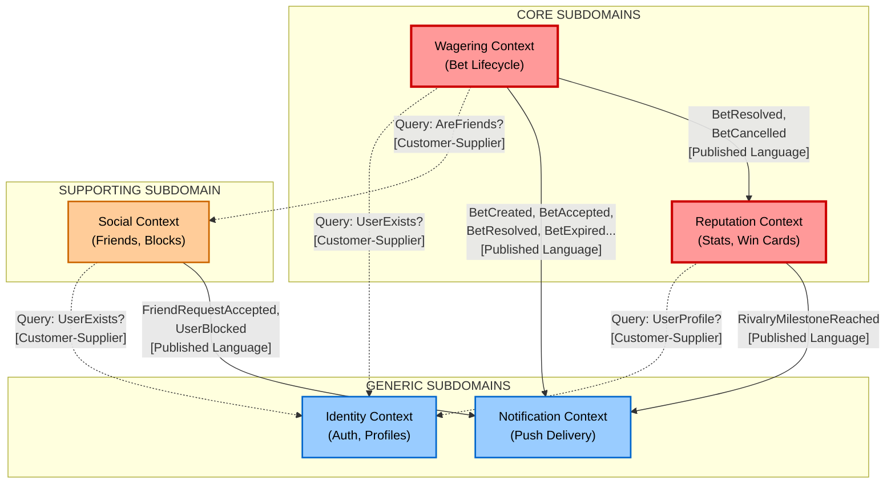
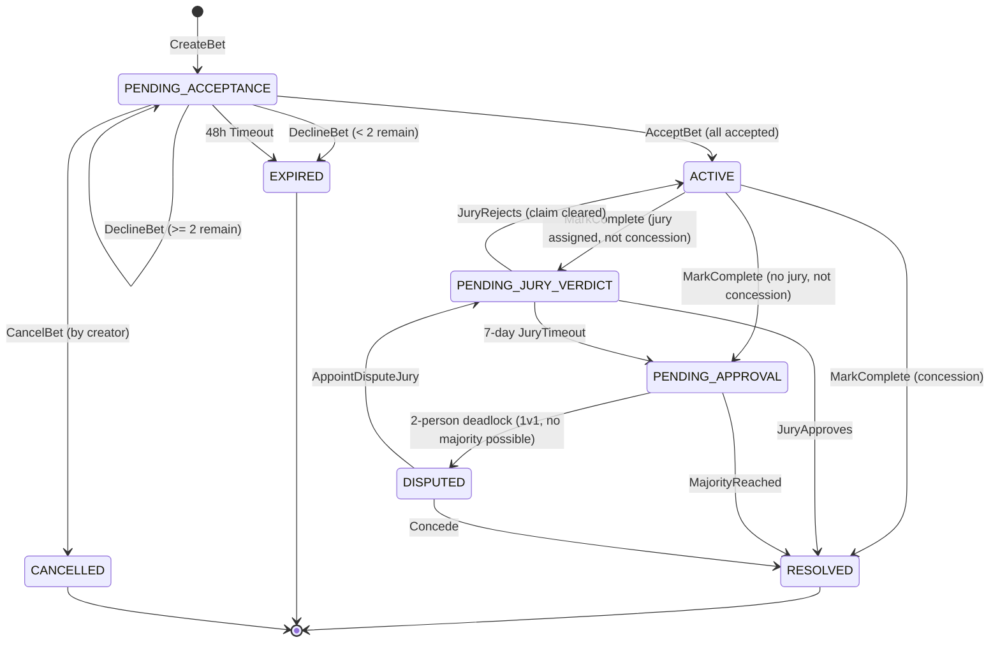

# iBetcha -- Domain-Driven Design Architecture

**Date:** 2026-05-08
**Design Direction:** B -- Bragging Rights Platform
**Status:** Complete -- ready for solution architecture and development handoff

---

## Table of Contents

1. [Ubiquitous Language](#1-ubiquitous-language)
2. [Bounded Contexts](#2-bounded-contexts)
3. [Context Map](#3-context-map)
4. [Aggregates](#4-aggregates)
5. [Bet Lifecycle State Machine](#5-bet-lifecycle-state-machine)
6. [Event Storming Summary](#6-event-storming-summary)
7. [ES/CQRS Assessment](#7-escqrs-assessment)

---

## 1. Ubiquitous Language

These terms have precise meaning in the iBetcha domain. All teams must use these terms consistently. Terms are grouped by the bounded context that owns them.

### Wagering Context

| Term | Definition |
|------|-----------|
| **Bet** | A social contract between two or more participants, with defined terms and a stake, that progresses through a lifecycle from creation to resolution. The central aggregate of the system. |
| **Participant** | A user who is invited to or involved in a bet. Includes the creator. Every participant has a role (CREATOR or INVITEE) and a response status (PENDING, ACCEPTED, DECLINED). |
| **Creator** | The participant who created the bet. Has additional privileges: can cancel the bet before full acceptance. |
| **Stake** | What is on the line in a bet. Always free-text for MVP (e.g., "loser buys coffee", "bragging rights", "10 euros"). Not a monetary transaction -- a social promise. |
| **Jury** | An optional registered user (not a participant) designated to approve the outcome of a bet. The jury is passive at creation and active only at resolution. |
| **Quick Bet** | A bet created via the minimal flow: one or more friends, description, and stake. Defaults to no jury and 48-hour acceptance timeout. Same aggregate as Full Bet -- just fewer fields populated. |
| **Full Bet** | A bet created with all optional fields: title, description, deadline, jury, evidence toggle, in addition to friends and stake. Same aggregate as Quick Bet. |
| **Evidence** | Optional photo or video uploaded during the "mark complete" flow to prove the outcome. Max 50MB after on-device compression. Evidence metadata is owned by the Bet; the binary is stored externally. |
| **Outcome Claim** | A declaration by any participant that the bet is complete, identifying a proposed winner. Triggers the approval flow. |
| **Approval Flow** | The process by which an outcome claim is verified. Either jury approval (single person decides) or majority approval (participants vote). |
| **Majority Approval** | For bets without a jury: outcome is accepted when more than 50% of participants approve. The declarer's chosen winner has their implicit approval. |
| **Dispute** | A state entered when a 2-person no-jury bet has conflicting outcome claims. Resolved by concession or appointing a jury after the fact. |
| **Concession** | When a participant in a disputed bet voluntarily accepts the other's outcome claim. Resolves the dispute. |
| **Win Card** | An auto-generated shareable image summarizing a resolved bet: description, winner, loser(s), stakes, head-to-head record, evidence thumbnail, iBetcha branding. The viral mechanic. |

### Identity Context

| Term | Definition |
|------|-----------|
| **User** | A registered individual with credentials (OAuth or email/password), a unique username, and a profile. The foundational identity entity. |
| **Username** | A unique, immutable (for MVP) identifier chosen at registration. Alphanumeric plus underscores and periods. Used for friend discovery. |
| **Profile** | A user's public identity: display name, avatar, bio. Editable by the user. |
| **Account Deletion** | A soft-delete with a 30-day grace period. During grace, re-login cancels deletion. After grace, all data is permanently purged (GDPR). |

### Social Context

| Term | Definition |
|------|-----------|
| **Friendship** | A mutual, bidirectional connection between two users. Both must agree (request + accept). Removing is also mutual -- both lose the connection. |
| **Friend Request** | A unidirectional request from one user to another. Can be accepted or declined. Declined requests are silent (no notification to requester). |
| **Invite Link** | A unique deep link with an embedded referral code, shareable via WhatsApp or other channels. When a new user registers through this link, they are auto-connected as friends with the inviter. |
| **Block** | A safety mechanism. Blocking removes friendship, cancels pending bets between the parties, and makes both invisible to each other. Silent (no notification to blocked user). |

### Reputation Context

| Term | Definition |
|------|-----------|
| **Win/Loss Record** | A user's aggregate betting outcome: total wins, total losses, derived win rate percentage. Only resolved bets count. Expired, cancelled, and disputed bets are excluded. |
| **Streak** | A consecutive sequence of wins (or losses) in resolved bets. Resets when the opposite outcome occurs. Displayed as "3W" or "2L". |
| **Head-to-Head Record** | The win/loss record between two specific users across all their mutual resolved bets. Displayed as "You vs Tom: 3-2". |
| **Rivalry** | An emergent relationship between two users who bet frequently. Surfaced through head-to-head records and milestone notifications. Not a first-class entity in MVP -- derived from betting data. |
| **Rivalry Milestone** | A notification triggered when head-to-head records reach notable states: tied records ("You and Tom are now tied 4-4!"), significant streaks, or lead changes. |

### Notification Context

| Term | Definition |
|------|-----------|
| **Lifecycle Notification** | A push notification triggered by a bet state transition: created, accepted, declined, completed, resolved, expired, cancelled. |
| **Reminder Notification** | A time-triggered notification: 24-hour acceptance reminder, jury reminders at day 3 and day 6. |
| **Rivalry Notification** | A notification triggered by reputation milestones: tied records, streak milestones. |
| **Actionable Notification** | A push notification with embedded action buttons (Accept/Decline, Approve/Reject) that can be acted upon without opening the app. |

---

## 2. Bounded Contexts

### 2.1 Wagering Context (Core Subdomain)

**Responsibility:** Owns the entire bet lifecycle from creation through resolution. This is the heart of iBetcha -- the structured bet lifecycle is the backbone upon which everything else is layered.

**Why Core:** The bet lifecycle with its jury system, majority approval, dispute handling, and timeout mechanics is the proprietary domain logic that differentiates iBetcha from WhatsApp + memory. No off-the-shelf solution exists. This is where competitive advantage lives.

**Key domain concepts owned:**
- Bet (aggregate root) -- the entire lifecycle, state machine, invariants
- Participant (entity within Bet) -- role, response status, votes
- Outcome Claim -- proposed winner, evidence metadata, approval state
- Jury designation and jury verdict
- Majority voting and dispute mechanics

**What it does NOT own:**
- User identity and authentication (Identity Context)
- Friend relationships (Social Context)
- Win/loss statistics and streaks (Reputation Context)
- Evidence binary storage (infrastructure concern, not domain)
- Push notification delivery (Notification Context)

---

### 2.2 Identity Context (Generic Subdomain)

**Responsibility:** User registration, authentication, session management, profile management, and account lifecycle (deletion, suspension).

**Why Generic:** OAuth flows, password hashing, session tokens, and profile CRUD are well-understood patterns with no iBetcha-specific innovation. Use proven libraries and infrastructure.

**Key domain concepts owned:**
- User (aggregate root) -- credentials, username, profile data
- Authentication (OAuth tokens, password hashes, sessions)
- Account lifecycle (active, deletion-pending, deleted)
- Profile (display name, avatar, bio)

**What it does NOT own:**
- What a user can do within the app (authorization rules live with each context)
- Betting statistics (those are in Reputation)
- Friend relationships (those are in Social)

---

### 2.3 Social Context (Supporting Subdomain)

**Responsibility:** Friendships, friend requests, user search, invite links, and user blocking. Manages the social graph that enables betting.

**Why Supporting:** The social graph is necessary for iBetcha to function (you must have friends to bet with) but the logic is not complex or proprietary. Friend request/accept/decline is a standard social pattern. The innovation is in the deep link invite flow, which is more of an integration concern than domain logic.

**Key domain concepts owned:**
- Friendship (aggregate root) -- bidirectional, mutual
- Friend Request (entity) -- pending, accepted, declined
- Invite Link (value object) -- referral code, expiration policy
- Block (entity) -- blocker/blocked relationship, cascading effects

**What it does NOT own:**
- User identity or profiles (Identity)
- Bet creation or validation of participants (Wagering checks friendship via a query, not by owning the concept)

---

### 2.4 Reputation Context (Core Subdomain)

**Responsibility:** Computes and serves win/loss records, streaks, head-to-head stats, rivalry milestones, and Win Cards. This is the "Bragging Rights" layer -- the differentiator that makes iBetcha more than a task tracker for bets.

**Why Core:** The Bragging Rights Platform direction (Direction B) makes reputation the product. Win/loss records, streaks, head-to-head rivalries, and shareable Win Cards are what drive retention and viral sharing. This is proprietary domain logic that cannot be bought off the shelf.

**Key domain concepts owned:**
- Player Stats (aggregate root) -- wins, losses, win rate, current streak
- Head-to-Head Record (value object) -- record between two specific users
- Win Card (value object) -- generated shareable image metadata
- Rivalry Milestone detection logic

**Input:** Consumes BetResolved events from the Wagering Context.

**Output:** Provides read models for profiles, friend profiles, and rivalry notifications.

---

### 2.5 Notification Context (Generic Subdomain)

**Responsibility:** Receives domain events from all contexts and delivers push notifications to users. Manages notification preferences, delivery tracking, and actionable notification payloads.

**Why Generic:** Push notification delivery (FCM/APNs) is standard infrastructure. The notification templates are domain-specific, but the delivery mechanism is not. This context translates domain events into user-facing messages.

**Key domain concepts owned:**
- Notification (aggregate root) -- recipient, type, payload, delivery status
- Notification Template -- maps domain events to user-facing messages
- Device Token -- push notification endpoint per user per device

**What it does NOT own:**
- When to send notifications (decided by the source context emitting events)
- What the user sees in the app (that is UI, not domain)

---

## 3. Context Map

### 3.1 Relationships



### 3.2 Relationship Patterns

| Upstream | Downstream | Pattern | Rationale |
|----------|------------|---------|-----------|
| **Wagering** | **Reputation** | Published Language (domain events) | Wagering publishes BetResolved events. Reputation subscribes and updates stats. No coupling -- Reputation interprets events independently. |
| **Wagering** | **Notification** | Published Language (domain events) | Wagering publishes lifecycle events. Notification translates to push messages. Wagering does not know or care about notification delivery. |
| **Social** | **Notification** | Published Language (domain events) | Social publishes FriendRequestAccepted, UserBlocked. Notification delivers corresponding pushes. |
| **Reputation** | **Notification** | Published Language (domain events) | Reputation detects rivalry milestones and publishes events. Notification delivers. |
| **Social** | **Wagering** | Customer-Supplier (query) | Wagering is the customer -- it needs to verify friendship exists before allowing bet creation. Social is the supplier of friendship data. Wagering holds no friendship data itself. |
| **Identity** | **Wagering** | Customer-Supplier (query) | Wagering validates that users (participants, jury) exist by querying Identity. |
| **Identity** | **Social** | Customer-Supplier (query) | Social validates user existence for friend requests and search. |
| **Identity** | **Reputation** | Customer-Supplier (query) | Reputation queries Identity for profile data to compose Win Cards and profile views. |

### 3.3 Anti-Corruption Layer Notes

For MVP with a monolithic deployment, these context boundaries are enforced at the package level, not at the network level. Each context exposes its public API through a well-defined interface (Java interface + DTOs). No context directly accesses another context's database tables or internal entities.

If/when contexts are extracted to separate services, the Published Language events become actual message broker messages, and the Customer-Supplier queries become API calls or shared read models. The ACL at that point would wrap external service responses into internal domain objects.

---

## 4. Aggregates

### 4.1 Wagering Context

#### 4.1.1 Aggregate: Bet

This is the most complex aggregate in the system. It owns the entire bet lifecycle state machine.

**Aggregate Root:** `Bet`

**Entities within the aggregate:**
- `Participant` -- represents a user's involvement in this bet. Contains: userId (reference), role (CREATOR/INVITEE), responseStatus (PENDING/ACCEPTED/DECLINED), vote (NONE/APPROVE/DISPUTE).
- `OutcomeClaim` -- represents a claim that the bet is complete. Contains: claimantUserId, proposedWinnerUserId, evidenceRef (optional), claimedAt, status (PENDING_APPROVAL/APPROVED/REJECTED).

**Value Objects:**
- `BetId` -- unique identifier
- `Stake` -- free-text description of what is on the line
- `BetDescription` -- the bet terms (free text)
- `BetTitle` -- optional short label
- `Deadline` -- optional completion deadline (date/time)
- `EvidenceReference` -- pointer to evidence in S3 (media type, S3 key, file size)
- `JuryDesignation` -- userId of the designated jury (optional)

**Invariants the Bet aggregate protects:**

| # | Invariant | Rule |
|---|-----------|------|
| I1 | A bet must have at least one invitee (besides the creator) | Enforced at creation. Min 2 participants total. |
| I2 | The jury cannot be a participant | JuryDesignation.userId must not appear in Participants list. |
| I3 | A bet can only be cancelled by the creator, and only before all participants have accepted | Cancel command rejected if state is not PENDING_ACCEPTANCE. |
| I4 | A bet becomes ACTIVE only when all (non-declined) participants have accepted | State transition from PENDING_ACCEPTANCE to ACTIVE requires all remaining participants to have ACCEPTED status. |
| I5 | Only participants of an active bet can submit an outcome claim | Mark-complete command rejected if the bet is not ACTIVE or if the submitter is not a participant. |
| I6 | A concession (selecting someone else as winner) resolves immediately without approval | If OutcomeClaim.proposedWinnerUserId != claimantUserId, skip approval flow. |
| I7 | Majority approval requires >50% of participants to approve | Majority = floor(participantCount / 2) + 1. |
| I8 | A 2-person no-jury bet with conflicting claims enters DISPUTED state | Cannot be resolved by majority (1 vs 1 is not a majority). |
| I9 | A bet can only have one active outcome claim at a time | New claim rejected if an existing claim is in PENDING_APPROVAL status (unless jury rejected the prior claim). |
| I10 | Evidence cannot exceed 50MB per item | Validated before acceptance of evidence reference. |
| I11 | Deadline, if set, must be in the future at creation time | Validated at creation. |
| I12 | At least 2 participants must remain after declines for a bet to proceed | If declines reduce participants below 2, bet auto-expires. |

**Vernon's Four Rules Assessment:**
1. **Protect true invariants in consistency boundaries:** The Bet aggregate owns all invariants related to the bet lifecycle -- participant acceptance, outcome claiming, voting, and state transitions. These must be consistent within a single transaction.
2. **Design small aggregates:** The Bet aggregate contains participants and outcome claims as entities, not separate aggregates, because the invariants (I4, I6, I7, I8) span across participants and the outcome claim. You cannot validate "majority of participants approved" without all participants being in the same consistency boundary. This is justified complexity.
3. **Reference other aggregates by identity:** The Bet references users by UserId, the jury by UserId, and evidence by S3 key. No direct object references to User or Friendship entities.
4. **Use eventual consistency for cross-aggregate rules:** Stats updates, Win Card generation, and notification delivery all happen asynchronously via domain events after bet resolution.

**Commands:**

| Command | Pre-conditions | State Transition | Events Emitted |
|---------|---------------|-----------------|----------------|
| CreateBet | Creator exists, all invitees exist, all invitees are friends of creator, jury (if set) is not a participant and exists | -- to PENDING_ACCEPTANCE | BetCreated |
| AcceptBet | Bet is PENDING_ACCEPTANCE, user is a PENDING participant | If all accepted: PENDING_ACCEPTANCE to ACTIVE. Otherwise stays PENDING_ACCEPTANCE. | BetAccepted, (BetActivated if last) |
| DeclineBet | Bet is PENDING_ACCEPTANCE, user is a PENDING participant | Participant marked DECLINED. If remaining < 2: PENDING_ACCEPTANCE to EXPIRED. | BetDeclined, (BetExpired if too few remain) |
| CancelBet | Bet is PENDING_ACCEPTANCE, user is the creator | PENDING_ACCEPTANCE to CANCELLED | BetCancelled |
| ExpireBet (system) | Bet is PENDING_ACCEPTANCE, 48h elapsed since creation | PENDING_ACCEPTANCE to EXPIRED | BetExpired |
| MarkComplete | Bet is ACTIVE, user is a participant | ACTIVE to PENDING_JURY_VERDICT (if jury) or PENDING_APPROVAL (if no jury). If concession: ACTIVE to RESOLVED. | OutcomeClaimed, (BetResolved if concession) |
| ApproveOutcome (jury) | Bet is PENDING_JURY_VERDICT, user is the designated jury | PENDING_JURY_VERDICT to RESOLVED | JuryApproved, BetResolved |
| RejectOutcome (jury) | Bet is PENDING_JURY_VERDICT, user is the designated jury | PENDING_JURY_VERDICT to ACTIVE (claim cleared) | JuryRejected |
| VoteOnOutcome | Bet is PENDING_APPROVAL, user is a participant (not the claimant's chosen winner who has implicit vote) | If majority reached: PENDING_APPROVAL to RESOLVED. If 2-person deadlock: PENDING_APPROVAL to DISPUTED. | OutcomeVoteCast, (BetResolved if majority), (BetDisputed if deadlock) |
| EscalateJuryTimeout (system) | Bet is PENDING_JURY_VERDICT, 7 days elapsed since outcome claimed | PENDING_JURY_VERDICT to PENDING_APPROVAL | JuryTimedOut |
| Concede | Bet is DISPUTED, user is a participant | DISPUTED to RESOLVED | DisputeConceded, BetResolved |
| AppointDisputeJury | Bet is DISPUTED, both participants agree on a jury userId | DISPUTED to PENDING_JURY_VERDICT | DisputeJuryAppointed |

**Domain Events Emitted:**

| Event | Payload | Consumers |
|-------|---------|-----------|
| BetCreated | betId, creatorId, participantIds, juryId?, description, stake, deadline? | Notification |
| BetAccepted | betId, participantId | Notification |
| BetActivated | betId, participantIds | Notification |
| BetDeclined | betId, participantId | Notification |
| BetCancelled | betId, participantIds | Notification, Reputation (no-op, but for completeness) |
| BetExpired | betId, participantIds, reason (timeout/insufficient_participants) | Notification |
| OutcomeClaimed | betId, claimantId, proposedWinnerId, evidenceRef? | Notification |
| JuryApproved | betId, juryId, winnerId | (Internal to bet -- triggers BetResolved) |
| JuryRejected | betId, juryId | Notification |
| JuryTimedOut | betId, juryId | Notification |
| OutcomeVoteCast | betId, voterId, vote (APPROVE/DISPUTE) | (Internal to bet state) |
| BetResolved | betId, winnerId, loserId(s), stake, participantIds, resolvedAt | Reputation, Notification |
| BetDisputed | betId, participantIds | Notification |
| DisputeConceded | betId, concederId, winnerId | (Internal -- triggers BetResolved) |
| DisputeJuryAppointed | betId, juryId | Notification |

---

#### 4.1.2 Why Bet is a Single Aggregate (Not Split)

A reasonable question is whether OutcomeClaim or the voting process should be separate aggregates. They should not, for these reasons:

1. **Invariant I9** (one active claim at a time) requires knowing the current claim status when a new one is attempted.
2. **Invariant I7** (majority approval) requires knowing the total participant count and all votes in the same transaction.
3. **Invariant I8** (2-person deadlock detection) requires knowing participant count and conflicting claims simultaneously.
4. **State transitions** (ACTIVE to PENDING_APPROVAL to RESOLVED) must be atomic -- you cannot have a bet in ACTIVE state with a separately-committed approved outcome.

The Bet aggregate is larger than the typical "root + value objects only" recommendation, but this is one of the ~30% of cases where multiple entities within an aggregate are justified by true transactional invariants.

**Size check:** At maximum, a bet has ~10 participants (realistic ceiling for social bets). The aggregate loads a small number of entities. This is not a scalability concern.

---

### 4.2 Identity Context

#### 4.2.1 Aggregate: User

**Aggregate Root:** `User`

**Value Objects:**
- `UserId` -- unique identifier
- `Username` -- unique, immutable, alphanumeric + underscore + period
- `EmailAddress` -- unique
- `HashedPassword` -- bcrypt hash (for email/password auth)
- `OAuthLink` -- provider + provider-specific user ID (for OAuth)
- `Profile` -- displayName, avatarUrl, bio (max 150 chars)
- `AccountStatus` -- ACTIVE, DELETION_PENDING, DELETED

**Invariants:**

| # | Invariant | Rule |
|---|-----------|------|
| I1 | Username must be unique across all users | Enforced at creation. |
| I2 | Email must be unique across all users | Enforced at creation. |
| I3 | Username format: letters, numbers, underscores, periods only | Validated at creation. |
| I4 | Password minimum 8 characters, at least 1 number | Validated at creation (email/password flow only). |
| I5 | Account deletion has a 30-day grace period | Deletion request sets status to DELETION_PENDING with a scheduled purge date. Login during grace cancels deletion. |
| I6 | Bio max 150 characters | Validated on profile update. |

**Vernon's Four Rules:** This is a textbook small aggregate -- root entity with value-typed properties. No child entities. References nothing by object, only by value.

**Commands:**

| Command | Events Emitted |
|---------|----------------|
| RegisterUser | UserRegistered |
| UpdateProfile | ProfileUpdated |
| InitiateAccountDeletion | AccountDeletionInitiated |
| CancelAccountDeletion | AccountDeletionCancelled |
| PurgeAccount (system, after 30 days) | AccountPurged |

---

### 4.3 Social Context

#### 4.3.1 Aggregate: Friendship

**Aggregate Root:** `Friendship`

**Design Note:** A Friendship is modeled as a single aggregate representing the bidirectional relationship between two users. It is NOT two separate unidirectional records. This ensures mutual removal is atomic.

**Value Objects:**
- `FriendshipId` -- unique identifier
- `UserIdA`, `UserIdB` -- the two users (order-independent -- always stored with lower ID first for uniqueness)
- `FriendshipStatus` -- PENDING_A_TO_B, PENDING_B_TO_A, ACTIVE, REMOVED
- `CreatedAt`, `AcceptedAt`

**Invariants:**

| # | Invariant | Rule |
|---|-----------|------|
| I1 | A friendship between two users is unique | Only one Friendship aggregate can exist per user pair. |
| I2 | A friendship requires acceptance from the recipient | Status transitions from PENDING to ACTIVE only on recipient action. |
| I3 | Removal is mutual | Removing a friendship sets status to REMOVED for both. |
| I4 | Cannot send a friend request to a blocked user | Validated against Block list before creation. |

**Commands:**

| Command | Events Emitted |
|---------|----------------|
| SendFriendRequest | FriendRequestSent |
| AcceptFriendRequest | FriendRequestAccepted |
| DeclineFriendRequest | FriendRequestDeclined |
| RemoveFriend | FriendRemoved |

#### 4.3.2 Aggregate: Block

**Aggregate Root:** `Block`

**Design Note:** Blocks are separate from Friendships because blocking has cascading effects beyond the friendship (cancels pending bets, hides from search). Keeping it separate follows the single-responsibility principle and allows the block check to be a fast, independent query.

**Value Objects:**
- `BlockId` -- unique identifier
- `BlockerId` -- the user who initiated the block
- `BlockedId` -- the user who is blocked
- `BlockedAt`

**Invariants:**

| # | Invariant | Rule |
|---|-----------|------|
| I1 | A user cannot block themselves | BlockerId != BlockedId. |
| I2 | A block between two users is unique in one direction | Only one Block per ordered (blocker, blocked) pair. |

**Commands:**

| Command | Events Emitted |
|---------|----------------|
| BlockUser | UserBlocked |
| UnblockUser | UserUnblocked |

**Side Effects of UserBlocked (eventual consistency):**
- Social Context: removes any Friendship between the two users.
- Wagering Context: cancels any PENDING_ACCEPTANCE bets where both are participants.
- Social Context: marks any pending friend requests between them as void.

These side effects are handled via the UserBlocked domain event, not within the Block aggregate transaction. This is eventual consistency by design.

#### 4.3.3 Aggregate: InviteLink

**Aggregate Root:** `InviteLink`

**Value Objects:**
- `InviteLinkId` -- unique identifier
- `InviterUserId` -- the user who generated the link
- `ReferralCode` -- unique code embedded in the deep link URL
- `CreatedAt`

**Invariants:**

| # | Invariant | Rule |
|---|-----------|------|
| I1 | Referral code must be unique | Generated uniquely. |
| I2 | Links do not expire for MVP | No expiration validation. |

**Commands:**

| Command | Events Emitted |
|---------|----------------|
| GenerateInviteLink | InviteLinkGenerated |
| RedeemInviteLink | InviteLinkRedeemed (triggers auto-friendship) |

---

### 4.4 Reputation Context

#### 4.4.1 Aggregate: PlayerStats

**Aggregate Root:** `PlayerStats`

**Design Note:** PlayerStats is a read-model-like aggregate that is updated asynchronously when BetResolved events are consumed. It does not process commands from users -- it reacts to domain events.

**Value Objects:**
- `PlayerStatsId` -- equals the UserId (one-to-one)
- `TotalWins` -- integer
- `TotalLosses` -- integer
- `WinRate` -- derived (wins / (wins + losses) * 100)
- `CurrentStreak` -- integer + direction (WIN/LOSS)
- `LongestWinStreak` -- integer

**Child Value Object Collection:**
- `HeadToHeadRecord` -- opponentUserId, wins, losses. One per opponent.

**Invariants:**

| # | Invariant | Rule |
|---|-----------|------|
| I1 | Win rate is always derived, never stored independently | Calculated from wins and losses. |
| I2 | Only resolved bets count | Expired, cancelled, and disputed (unresolved) bets do not affect stats. |
| I3 | Head-to-head is symmetric | If A beats B, both A's and B's head-to-head records update. |

**Vernon's Four Rules:** This is a small aggregate. Root entity with value objects. HeadToHeadRecord could grow large for very active users, but in practice, people bet with a limited circle of friends (realistically 5-20 opponents). No scalability concern.

**Consumed Events:**

| Event | Action |
|-------|--------|
| BetResolved | Increment winner's wins, loser's losses. Update streaks. Update head-to-head for all participant pairs. Detect rivalry milestones. |

**Events Emitted:**

| Event | Payload | Consumers |
|-------|---------|-----------|
| RivalryMilestoneReached | userId1, userId2, milestoneType (TIED, LEAD_CHANGE, STREAK), details | Notification |

#### 4.4.2 Value Object: WinCard

Win Cards are not a separate aggregate. They are generated on-demand (or eagerly upon resolution) as a value object containing the data needed to render the shareable image:

- `BetDescription`
- `WinnerName`, `WinnerAvatarUrl`
- `LoserName(s)`
- `Stake`
- `HeadToHeadRecord` (post-resolution)
- `EvidenceThumbnailUrl` (optional)
- `DeepLinkUrl`
- `GeneratedAt`

The actual image rendering is an infrastructure concern (template + data = image), not a domain concern.

---

### 4.5 Notification Context

#### 4.5.1 Aggregate: Notification

**Aggregate Root:** `Notification`

**Value Objects:**
- `NotificationId` -- unique identifier
- `RecipientUserId` -- who receives this
- `NotificationType` -- BET_CREATED, BET_ACCEPTED, BET_DECLINED, BET_ACTIVATED, BET_EXPIRED, BET_CANCELLED, OUTCOME_CLAIMED, JURY_APPROVED, JURY_REJECTED, JURY_TIMED_OUT, BET_RESOLVED, BET_DISPUTED, FRIEND_REQUEST, FRIEND_ACCEPTED, RIVALRY_MILESTONE, ACCEPTANCE_REMINDER, JURY_REMINDER
- `Payload` -- structured data for rendering the notification (title, body, action buttons, deep link)
- `DeliveryStatus` -- PENDING, SENT, DELIVERED, FAILED
- `CreatedAt`, `SentAt`

**Invariants:**

| # | Invariant | Rule |
|---|-----------|------|
| I1 | Notification must be delivered within 5 seconds of creation | SLA, not a domain invariant -- monitored operationally. |
| I2 | Actionable notifications must include action button definitions | Validated at creation for applicable types. |

**Vernon's Four Rules:** Textbook small aggregate. Root with value objects only. Created from domain events, pushed to FCM/APNs, status tracked.

#### 4.5.2 Value Object: DeviceToken

Stored per user, managed outside the Notification aggregate:
- `UserId`
- `DeviceToken` -- FCM or APNs token
- `Platform` -- iOS or Android
- `UpdatedAt`

---

## 5. Bet Lifecycle State Machine

### 5.1 States

| State | Description | Entry Condition |
|-------|-------------|----------------|
| **PENDING_ACCEPTANCE** | Bet created, waiting for all invitees to accept or decline. | Bet created by any user. |
| **ACTIVE** | All (remaining) participants accepted. Bet is live. | Last pending participant accepts. |
| **PENDING_JURY_VERDICT** | Outcome claimed, waiting for jury to approve or reject. | Outcome claimed on a bet with a designated jury. Also: dispute jury appointed. |
| **PENDING_APPROVAL** | Outcome claimed, waiting for participant majority vote (no jury or jury timed out). | Outcome claimed on a no-jury bet, or jury timeout escalation. |
| **RESOLVED** | Outcome approved. Winner and loser determined. Final state. | Jury approved, majority reached, or concession. |
| **DISPUTED** | 2-person no-jury bet with conflicting outcome claims. Deadlock. | Both participants vote for different winners in a 2-person no-jury bet. |
| **EXPIRED** | Bet timed out before all participants accepted, or too few participants remain. Terminal state. | 48h timeout, or declines reduce participants below 2. |
| **CANCELLED** | Creator cancelled the bet before full acceptance. Terminal state. | Creator cancels while in PENDING_ACCEPTANCE. |

### 5.2 State Transition Diagram



### 5.3 Detailed Transition Rules

#### Transition: PENDING_ACCEPTANCE --> ACTIVE

**Trigger:** AcceptBet command from the last pending participant.

**Rules:**
- All participants with status PENDING must have moved to ACCEPTED.
- Participants who DECLINED are excluded from the count.
- At least 2 participants must remain (invariant I12).

**Events:** BetAccepted (for each individual acceptance), BetActivated (when the last one accepts).

**Notifications:** Each acceptance notifies the creator. BetActivated notifies all participants ("Bet is ON!").

---

#### Transition: PENDING_ACCEPTANCE --> EXPIRED (Timeout)

**Trigger:** System scheduled job, 48 hours after bet creation.

**Rules:**
- Check that bet is still in PENDING_ACCEPTANCE.
- Any participant who has not responded (still PENDING) is treated as non-responsive.
- Reminder sent at 24 hours before expiry.

**Events:** BetExpired (reason: ACCEPTANCE_TIMEOUT).

**Notifications:** All parties notified: creator, accepted participants, non-responders.

---

#### Transition: PENDING_ACCEPTANCE --> EXPIRED (Insufficient Participants)

**Trigger:** DeclineBet command that reduces remaining participants below 2.

**Rules:**
- After removing the declining participant, count remaining (ACCEPTED + PENDING).
- If < 2, the bet cannot proceed.

**Events:** BetDeclined, BetExpired (reason: INSUFFICIENT_PARTICIPANTS).

---

#### Transition: ACTIVE --> PENDING_JURY_VERDICT

**Trigger:** MarkComplete command on a bet with a jury, where the claimant selected themselves or another participant as winner (not a concession to themselves).

**Clarification on concession:** A concession occurs when the claimant selects someone else as winner. This is an admission of defeat. It does not need jury or participant approval. It resolves immediately.

**Rules:**
- Only participants can mark complete.
- The proposed winner must be a participant.
- If the proposed winner is someone other than the claimant, this is a concession (skip to RESOLVED).
- Evidence reference is optional.

**Events:** OutcomeClaimed.

---

#### Transition: ACTIVE --> RESOLVED (Concession)

**Trigger:** MarkComplete where claimant selects a different participant as winner.

**Rules:**
- This is a voluntary admission of defeat. No approval needed.
- Winner is the selected participant.
- Losers are all other participants (including the claimant).

**Events:** OutcomeClaimed, BetResolved.

**Rationale:** If you say "Tom won," you are conceding. There is no reason to make everyone vote on something the claimant already admits.

---

#### Transition: PENDING_JURY_VERDICT --> RESOLVED (Jury Approves)

**Trigger:** ApproveOutcome command from the designated jury user.

**Rules:**
- Only the designated jury can approve.
- Jury can only act once per claim.

**Events:** JuryApproved, BetResolved.

---

#### Transition: PENDING_JURY_VERDICT --> ACTIVE (Jury Rejects)

**Trigger:** RejectOutcome command from the designated jury user.

**Rules:**
- Only the designated jury can reject.
- The outcome claim is cleared. The bet returns to ACTIVE so participants can try again.

**Events:** JuryRejected.

**Post-condition:** Any participant can submit a new outcome claim.

---

#### Transition: PENDING_JURY_VERDICT --> PENDING_APPROVAL (Jury Timeout)

**Trigger:** System scheduled job, 7 days after outcome was claimed.

**Rules:**
- Jury did not respond within 7 days.
- Reminders were sent at day 3 and day 6.
- Escalate to participant majority vote.
- The original claim stands -- participants vote on the same proposed winner.

**Events:** JuryTimedOut.

---

#### Transition: PENDING_APPROVAL --> RESOLVED (Majority)

**Trigger:** VoteOnOutcome where the approve count reaches majority.

**Rules:**
- The proposed winner has an implicit APPROVE vote.
- The claimant (if different from the proposed winner) has an implicit APPROVE vote (they selected this winner).
- Each remaining participant votes APPROVE or DISPUTE.
- Majority = floor(totalParticipants / 2) + 1.
- Example (4 participants): majority = 3. If claimant + proposed winner + 1 other approve, majority reached.
- Example (3 participants): majority = 2. If claimant + proposed winner are the same person, they have 1 implicit vote. Need 1 more.
- Example (2 participants, after jury timeout): majority = 2. If claimant is proposed winner (1 implicit), need the other person to approve. If they dispute, deadlock --> DISPUTED.

**Events:** OutcomeVoteCast, BetResolved.

---

#### Transition: PENDING_APPROVAL --> DISPUTED (2-Person Deadlock)

**Trigger:** VoteOnOutcome where a 2-person no-jury bet has 1 APPROVE and 1 DISPUTE.

**Rules:**
- This can only happen in a 2-person bet.
- For 3+ person bets, a strict majority is always possible (no even split blocks resolution, the vote stays open until enough people vote).
- The deadlock detection fires when the second participant votes DISPUTE (the first implicitly voted APPROVE by claiming).

**Events:** BetDisputed.

**Clarification for 3+ person bets:** If a 4-person bet has a 2-2 split, the bet stays in PENDING_APPROVAL. It does not move to DISPUTED. The vote remains open. Participants can change their vote, or the "Appoint Jury" option becomes available from this state as well if all remaining voters agree.

---

#### Transition: DISPUTED --> RESOLVED (Concede)

**Trigger:** Concede command from either participant.

**Rules:**
- Either participant can concede at any time.
- The other participant is declared the winner.

**Events:** DisputeConceded, BetResolved.

---

#### Transition: DISPUTED --> PENDING_JURY_VERDICT (Appoint Dispute Jury)

**Trigger:** AppointDisputeJury command.

**Rules:**
- Both participants must agree on the jury (two-step: one proposes, other confirms).
- The proposed jury must not be a participant in the bet.
- The proposed jury must be a registered user.
- Once appointed, standard jury flow applies (7-day timeout, approve/reject).

**Events:** DisputeJuryAppointed.

---

### 5.4 Edge Cases

| Edge Case | Resolution |
|-----------|-----------|
| **All invitees decline** | When the last invitee declines, the bet expires (INSUFFICIENT_PARTICIPANTS). The creator is notified. |
| **Creator declines their own bet** | Not allowed. Creator can only cancel, not decline. The creator is always an implicit ACCEPTED participant. |
| **Participant tries to accept after timeout** | Command rejected. Bet is already in EXPIRED state. User sees "This bet has expired." |
| **Jury approves after timeout** | Command rejected. Bet has already transitioned to PENDING_APPROVAL via JuryTimedOut. The jury's window has passed. |
| **Same person submits outcome claim twice** | Rejected if existing claim is in PENDING_APPROVAL or PENDING_JURY_VERDICT. Allowed if previous claim was rejected by jury (bet returned to ACTIVE). |
| **Evidence uploaded after bet resolution** | Not allowed. Evidence is only accepted during the MarkComplete flow while the bet is ACTIVE. |
| **User is blocked after bet creation, before acceptance** | UserBlocked event triggers cancellation of any PENDING_ACCEPTANCE bets where both blocker and blocked are participants. |
| **User deletes account with active bets** | All active bets involving the deleted user are cancelled. The deleted user appears as "[Deleted User]" in historical bet records. |
| **3-person bet, 2-1 vote split with one person not voting** | Bet stays in PENDING_APPROVAL. The non-voter has not voted yet. Once they vote, either majority is reached (RESOLVED) or 2-1 stands (RESOLVED, majority reached). A 1-1-abstain is not a deadlock in a 3-person bet -- vote stays open. |
| **Deadline expires on active bet** | For MVP, the deadline is informational only. It does not auto-trigger completion. A reminder is sent, but participants must manually mark complete. This avoids the complexity of "who wins when nobody acts by the deadline?" |

---

## 6. Event Storming Summary

### 6.1 Flow: Quick Bet Creation through Resolution (Happy Path)

```
Timeline ------>

[Tom opens app]
    |
    v
Command: CreateBet(friend=Maria, desc="I'll beat you Sunday", stake="Coffee")
    |
    v
Event: BetCreated(betId=123, creator=Tom, invitees=[Maria], stake="Coffee")
    |
    +--> Notification: "Tom challenged you! Stake: Coffee" --> Maria
    |
[Maria sees notification]
    |
    v
Command: AcceptBet(betId=123, userId=Maria)
    |
    v
Event: BetAccepted(betId=123, participant=Maria)
Event: BetActivated(betId=123, participants=[Tom, Maria])
    |
    +--> Notification: "Bet is ON! Tom vs Maria" --> Tom, Maria
    |
[Sunday: Tom wins the ride]
    |
    v
Command: MarkComplete(betId=123, claimant=Tom, proposedWinner=Tom, evidence=photo.jpg)
    |
    v
Event: OutcomeClaimed(betId=123, claimant=Tom, winner=Tom, evidence=photo.jpg)
    |                                 (no jury, 2-person bet)
    +--> Notification: "Tom claims he won. Agree?" --> Maria
    |
[Maria agrees]
    |
    v
Command: VoteOnOutcome(betId=123, voter=Maria, vote=APPROVE)
    |
    v
Event: OutcomeVoteCast(betId=123, voter=Maria, vote=APPROVE)
Event: BetResolved(betId=123, winner=Tom, losers=[Maria], stake="Coffee")
    |
    +--> Reputation: Update Tom(+1 win), Maria(+1 loss), H2H: Tom 4-2 Maria
    +--> Notification: "You won! Record vs Maria: 4-2, streak: 2W" --> Tom
    +--> Notification: "Better luck next time. Record vs Tom: 2-4" --> Maria
    +--> Reputation: RivalryMilestoneReached? (check thresholds)
    +--> WinCard generated for Tom
```

### 6.2 Flow: Full Bet with Jury

```
Timeline ------>

Command: CreateBet(friends=[Tom, Maria, Ben], desc="5K challenge", stake="Pizza",
                   title="Weekend 5K", deadline=Sat 18:00, jury=Alex)
    |
    v
Event: BetCreated(betId=456, creator=Sarah, invitees=[Tom, Maria, Ben],
                  jury=Alex, deadline=Sat 18:00)
    |
    +--> Notification: "Sarah challenged you!" --> Tom, Maria, Ben
    +--> Notification: "You've been designated as jury" --> Alex
    |
[Tom accepts, Maria accepts, Ben accepts over 2 days]
    |
    v
Event: BetActivated(betId=456, participants=[Sarah, Tom, Maria, Ben])
    |
[Saturday: Race happens. Sarah declares Tom won.]
    |
    v
Command: MarkComplete(betId=456, claimant=Sarah, proposedWinner=Tom)
    |
    v
Event: OutcomeClaimed(betId=456, claimant=Sarah, winner=Tom)
    |                         (jury=Alex assigned)
    +--> Notification: "Sarah says Tom won the 5K. Review?" --> Alex
    |
[Alex reviews and approves]
    |
    v
Command: ApproveOutcome(betId=456, juryId=Alex)
    |
    v
Event: JuryApproved(betId=456, jury=Alex, winner=Tom)
Event: BetResolved(betId=456, winner=Tom, losers=[Sarah, Maria, Ben])
    |
    +--> Reputation: updates for all 4 participants + H2H pairs
    +--> Notifications to all
    +--> WinCard generated
```

### 6.3 Flow: Quick Bet vs Full Bet (Same Aggregate, Different Command Shape)

Quick Bet and Full Bet produce the exact same aggregate -- `Bet`. The difference is in the command payload:

```
QuickBet command payload:
{
    inviteeIds: [userId],       // required, 1+
    description: "...",          // required
    stake: "...",                // required
    juryId: null,                // defaults to null (majority approval)
    title: null,                 // auto-generated from description
    deadline: null,              // defaults to no completion deadline
    evidenceRequired: false      // defaults to false
}

FullBet command payload:
{
    inviteeIds: [userId, ...],   // required, 1+
    description: "...",          // required
    stake: "...",                // required
    juryId: userId,              // optional
    title: "...",                // optional
    deadline: dateTime,          // optional
    evidenceRequired: boolean    // optional
}
```

Both are handled by the same `CreateBet` command handler. The aggregate does not distinguish between "quick" and "full" -- that is a UI concern. The aggregate just validates the provided fields and applies defaults for missing optional fields.

**Decision:** One command, one handler, one aggregate. No need for separate QuickBet/FullBet command types.

### 6.4 Flow: Dispute (2-Person, No Jury)

```
Timeline ------>

[Tom's bet with Maria, no jury, is ACTIVE]
    |
Command: MarkComplete(betId=789, claimant=Tom, proposedWinner=Tom)
    |
Event: OutcomeClaimed --> State: PENDING_APPROVAL
    |
    +--> Notification: "Tom says he won. Agree?" --> Maria
    |
Command: VoteOnOutcome(betId=789, voter=Maria, vote=DISPUTE)
    |
Event: OutcomeVoteCast(vote=DISPUTE)
    |   (2-person bet: 1 APPROVE + 1 DISPUTE = deadlock)
    v
Event: BetDisputed(betId=789)  --> State: DISPUTED
    |
    +--> Notification: "Bet disputed. Concede or appoint a jury." --> Tom, Maria
    |
[Option A: Maria concedes after 2 days]
    |
Command: Concede(betId=789, conceder=Maria)
    |
Event: DisputeConceded, BetResolved(winner=Tom)
    |
[Option B: Both agree to appoint Alex as jury]
    |
Command: ProposeDisputeJury(betId=789, proposer=Tom, juryId=Alex)
Command: ConfirmDisputeJury(betId=789, confirmer=Maria, juryId=Alex)
    |
Event: DisputeJuryAppointed(juryId=Alex) --> State: PENDING_JURY_VERDICT
    |
    +--> Standard jury flow (approve/reject/7-day timeout)
```

### 6.5 Flow: Friend Invitation via Deep Link

```
Timeline ------>

[Tom generates invite link]
    |
Command: GenerateInviteLink(inviter=Tom)
    |
Event: InviteLinkGenerated(code="abc123", inviter=Tom)
    |
[Tom shares ibetcha.app/invite/abc123 via WhatsApp to Ben]
    |
[Ben taps link, installs app, registers]
    |
Command: RegisterUser(username="ben", ..., referralCode="abc123")
    |
Event: UserRegistered(userId=Ben)
    |
Command: RedeemInviteLink(code="abc123", redeemer=Ben)
    |
Event: InviteLinkRedeemed(inviter=Tom, redeemer=Ben)
    |
    +--> Social Context: auto-create Friendship(Tom, Ben, status=ACTIVE)
    +--> Notification: "Ben joined iBetcha! You're now friends." --> Tom
    +--> Notification: "You and Tom are now friends!" --> Ben
```

### 6.6 Flow: Jury Timeout Escalation

```
Timeline ------>

[Bet is in PENDING_JURY_VERDICT, jury=Alex]
    |
[Day 3: Alex has not responded]
    |
System: ScheduledJuryReminder
    +--> Notification: "Reminder: Tom vs Maria's bet awaits your verdict" --> Alex
    |
[Day 6: Alex still has not responded]
    |
System: ScheduledJuryFinalReminder
    +--> Notification: "Last chance: 24h to review before escalation" --> Alex
    |
[Day 7: Alex still has not responded]
    |
System: EscalateJuryTimeout(betId=123)
    |
Event: JuryTimedOut(betId=123, juryId=Alex)
    |
State: PENDING_JURY_VERDICT --> PENDING_APPROVAL
    |
    +--> Notification: "Jury did not respond. Outcome now decided by participant vote." --> All
    |
    +--> Standard majority vote flow begins
```

---

## 7. ES/CQRS Assessment

### 7.1 Event Sourcing Assessment

**Question: Should we use Event Sourcing for the Bet aggregate?**

#### Arguments FOR Event Sourcing

1. **Rich lifecycle with complex state transitions.** The Bet aggregate has 8 states and 15+ transitions. The state machine is the most complex piece of domain logic. ES would give a complete history of every transition.

2. **Audit trail.** Knowing exactly what happened to a bet (who accepted when, who voted what, when the jury responded) is valuable for dispute resolution and debugging.

3. **Temporal queries.** "What was the state of this bet at 3pm yesterday?" is a question that ES answers naturally but state-based persistence cannot.

4. **Event-driven architecture is already needed.** The domain naturally produces events (BetCreated, BetAccepted, BetResolved) that are consumed by Reputation and Notification contexts. These events exist regardless of whether we persist them as the source of truth.

#### Arguments AGAINST Event Sourcing

1. **Team familiarity.** ES introduces significant learning curve: event versioning, projection management, snapshotting, eventual consistency mental models. For a first MVP with a presumably small team, this is costly.

2. **Aggregate complexity is manageable without ES.** The Bet aggregate, while the most complex in the system, has at most ~10 participants and a linear lifecycle. The state can be fully represented by a single row with a status enum + child rows for participants and claims. This is well within what traditional state-based persistence handles cleanly.

3. **No replay requirement.** There is no business requirement to replay events, rebuild projections, or create new views of historical bet data. The read models (profiles, stats) are simple aggregations.

4. **Eventual consistency complications.** ES introduces eventual consistency between the event store and read models. For a social app where users expect to see their bet status update immediately after tapping "Accept," this creates UX friction or requires careful read-your-own-writes handling.

5. **Infrastructure overhead.** An event store (even if using PostgreSQL as the backing store) requires projection infrastructure, subscription management, and idempotency handling. This is significant work for an MVP.

#### Recommendation: NO Event Sourcing for MVP

**Use traditional state-based persistence with domain event publishing.**

The Bet aggregate stores its current state in PostgreSQL (status column, participant rows, outcome claim rows). When state transitions occur, domain events are published for downstream consumers (Reputation, Notification). These events can be persisted to an outbox table for reliable delivery, but they are NOT the source of truth for the Bet state.

**Why this is the right call for iBetcha:**

- The bet lifecycle is complex but linear. There are no branching timelines, no undo operations, no need to reconstruct past states. The current state is always what matters.
- The audit trail need can be met with a simple `bet_events` log table that records transitions (timestamp, betId, eventType, actorId, payload). This gives 80% of ES's audit benefit at 10% of the complexity.
- The team can add ES later for specific aggregates if the domain warrants it (e.g., if Phase 3 introduces tournament brackets with complex undo/redo). The domain event publishing infrastructure built now is the foundation for an ES migration later.

**Risk if wrong:** If the bet lifecycle becomes significantly more complex in later phases (bet modification with approval workflows, bet forking for tournament brackets), the state-based model may become difficult to maintain. At that point, migrating the Bet aggregate to ES is feasible because the events are already being published -- they just need to become the source of truth instead of a side effect.

---

### 7.2 CQRS Assessment

**Question: Should we separate the write model (bet lifecycle commands) from read models (profiles, stats, feeds)?**

#### Arguments FOR CQRS

1. **Naturally different read and write shapes.** The write model is the Bet aggregate with its state machine. The read models are: home screen (list of bets with statuses), profile (aggregated stats), friend profile (head-to-head), Win Card (denormalized bet + stats). These shapes are fundamentally different.

2. **Read-heavy workload.** Users will view profiles, browse friends' bets, and check stats far more often than they create or resolve bets. Optimized read models prevent N+1 queries and complex joins.

3. **Multiple consumers of the same data.** The BetResolved event needs to update: player stats, head-to-head records, streak calculations, Win Card data, and notification payloads. A single normalized write model would require complex joins for each of these views.

4. **Performance.** Profile stats (win rate, streak, head-to-head) are expensive to compute on every read from normalized tables. Pre-computed read models (updated on BetResolved) make reads trivial.

#### Arguments AGAINST Full CQRS

1. **Synchronization complexity.** Separate read and write models mean eventual consistency. A user who just accepted a bet might not see the status change immediately in their home screen if the read model lags.

2. **Infrastructure overhead.** Separate read model infrastructure (projections, event handlers, potentially separate database schemas) is significant for an MVP.

3. **Not every context needs it.** Identity and Social contexts are simple CRUD. Separating reads and writes there adds complexity for no benefit.

#### Recommendation: Lightweight CQRS for Reputation, Standard for Everything Else

**Apply CQRS selectively, not uniformly.**

| Context | Recommendation | Rationale |
|---------|---------------|-----------|
| **Wagering** | Standard (single model) | The bet detail screen shows exactly the data the aggregate contains. No complex join required. One model serves both reads and writes. |
| **Identity** | Standard (single model) | CRUD profile data. No separation benefit. |
| **Social** | Standard (single model) | Friend list queries are simple. No separation benefit. |
| **Reputation** | Lightweight CQRS | PlayerStats is already a separate read model updated by BetResolved events. Head-to-head records and streaks are pre-computed. This IS CQRS -- the write model is in Wagering, the read model is in Reputation. |
| **Notification** | Standard (single model) | Notifications are write-once, read-sequentially. No separation benefit. |

**What "Lightweight CQRS" means in practice:**

- The Reputation context does not accept user commands. It is a read model that reacts to domain events from Wagering.
- When a BetResolved event is consumed, Reputation updates the PlayerStats aggregate (wins, losses, streaks, head-to-head).
- Profile screens query Reputation for stats and Wagering for active bets. These are two queries, not one joined query. This is the CQRS boundary.
- All of this runs in the same application process (monolith), using the same PostgreSQL database (but different tables/schemas). There is no separate "read database."

**Home screen optimization:** The home screen (list of bets with statuses) reads directly from the Wagering context's tables. This is a simple query (SELECT bets WHERE participant = currentUser ORDER BY lastActivity). No CQRS needed. If performance becomes an issue at scale, a denormalized `user_bet_feed` table can be introduced as a read model later.

---

### 7.3 Summary of Architectural Decisions

| Decision | Choice | Rationale |
|----------|--------|-----------|
| Event Sourcing | NO for MVP | Complexity outweighs benefits. State-based persistence with event publishing gives us the foundation to add ES later if needed. |
| Domain Event Publishing | YES | Required for Reputation updates, Notification delivery, and cross-context communication. Use an outbox pattern for reliable delivery. |
| CQRS (Wagering) | NO | Single model serves both reads and writes adequately. |
| CQRS (Reputation) | YES (lightweight) | Stats are a separate read model reacting to Wagering events. This is natural CQRS. |
| CQRS (Identity, Social, Notification) | NO | Simple CRUD. No separation benefit. |
| Bet audit log | YES | Simple event log table (`bet_audit_log`) recording all transitions. Not ES -- just a log. Covers the audit need without ES complexity. |

---

## Appendix A: Aggregate Summary Table

| Context | Aggregate | Root Entity | Child Entities | Value Objects | Vernon Size |
|---------|-----------|-------------|----------------|---------------|-------------|
| Wagering | Bet | Bet | Participant, OutcomeClaim | BetId, Stake, BetDescription, BetTitle, Deadline, EvidenceReference, JuryDesignation | Large (justified -- transactional invariants span children) |
| Identity | User | User | -- | UserId, Username, EmailAddress, HashedPassword, OAuthLink, Profile, AccountStatus | Small (root + VOs only) |
| Social | Friendship | Friendship | -- | FriendshipId, UserIdA, UserIdB, FriendshipStatus | Small |
| Social | Block | Block | -- | BlockId, BlockerId, BlockedId | Small |
| Social | InviteLink | InviteLink | -- | InviteLinkId, InviterUserId, ReferralCode | Small |
| Reputation | PlayerStats | PlayerStats | -- | HeadToHeadRecord (collection of VOs), TotalWins, TotalLosses, CurrentStreak | Small |
| Notification | Notification | Notification | -- | NotificationId, NotificationType, Payload, DeliveryStatus | Small |

**Tally:** 7 aggregates total. 6 are small (root + VOs, following the ~70% rule). 1 is large (Bet, justified by transactional invariants). This aligns with Vernon's guidance.

---

## Appendix B: Key Domain Events (Cross-Context Communication)

This table shows which events cross context boundaries and how they flow:

| Event | Source Context | Consumer Context(s) | Delivery |
|-------|---------------|---------------------|----------|
| BetCreated | Wagering | Notification | Async (outbox) |
| BetAccepted | Wagering | Notification | Async (outbox) |
| BetActivated | Wagering | Notification | Async (outbox) |
| BetDeclined | Wagering | Notification | Async (outbox) |
| BetCancelled | Wagering | Notification | Async (outbox) |
| BetExpired | Wagering | Notification | Async (outbox) |
| OutcomeClaimed | Wagering | Notification | Async (outbox) |
| JuryRejected | Wagering | Notification | Async (outbox) |
| JuryTimedOut | Wagering | Notification | Async (outbox) |
| BetResolved | Wagering | Reputation, Notification | Async (outbox) |
| BetDisputed | Wagering | Notification | Async (outbox) |
| DisputeJuryAppointed | Wagering | Notification | Async (outbox) |
| FriendRequestSent | Social | Notification | Async (outbox) |
| FriendRequestAccepted | Social | Notification | Async (outbox) |
| UserBlocked | Social | Wagering (cancel pending bets), Notification | Async (outbox) |
| RivalryMilestoneReached | Reputation | Notification | Async (outbox) |
| UserRegistered | Identity | Social (redeem invite link) | Async (outbox) |
| AccountDeletionInitiated | Identity | Wagering (cancel active bets), Social (remove friendships) | Async (outbox) |

---

## Appendix C: Package Structure Recommendation

For a monolithic Spring Boot application, enforce bounded context boundaries at the package level:

```
com.ibetcha
    .wagering                    # Wagering Context
        .domain
            .model               # Bet, Participant, OutcomeClaim, value objects
            .event               # Domain events (BetCreated, BetResolved, etc.)
            .command             # Command objects
            .service             # Domain services (BetLifecycleService)
        .application             # Application services (command handlers, use cases)
        .infrastructure          # JPA repositories, outbox publisher
        .api                     # REST controllers for bet operations
    .identity                    # Identity Context
        .domain
        .application
        .infrastructure
        .api
    .social                      # Social Context
        .domain
        .application
        .infrastructure
        .api
    .reputation                  # Reputation Context
        .domain
        .application
        .infrastructure
        .api
    .notification                # Notification Context
        .domain
        .application
        .infrastructure
        .api
    .shared                      # Shared kernel (if any)
        .domain                  # UserId value object (shared across contexts)
```

**Rules:**
1. No package imports across context boundaries except through `.api` or published events.
2. Each context has its own JPA entities -- no shared database entities across contexts.
3. The `shared` package contains ONLY identifiers (UserId) that multiple contexts need to reference. Keep this minimal.
4. Cross-context queries go through defined interfaces (e.g., `FriendshipQueryService`), never through direct repository access.
