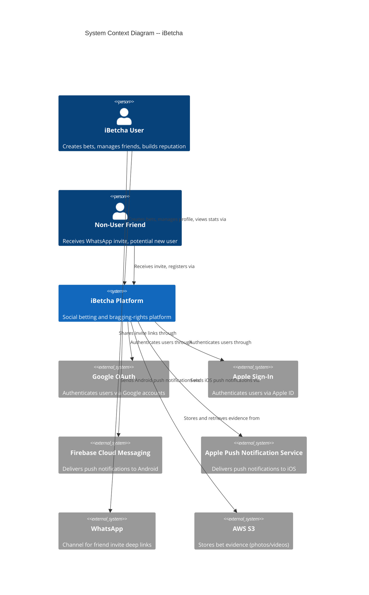
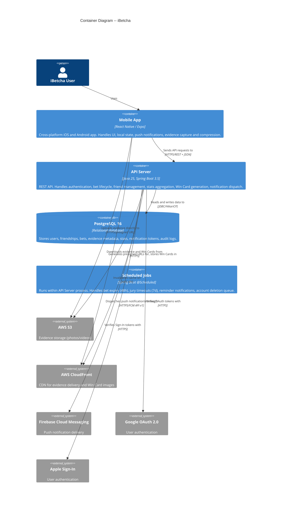

# iBetcha -- Solution Architecture

**Date:** 2026-05-08
**Status:** Ready for development handoff
**Design Direction:** B -- Bragging Rights Platform
**Architect:** Morgan (Solution Architect)

---
# iBetcha -- Solution Architecture
## Table of Contents

1. [System Overview](#1-system-overview)
2. [C4 Architecture Diagrams](#2-c4-architecture-diagrams)
3. [Tech Stack Decisions](#3-tech-stack-decisions)
4. [Component Architecture](#4-component-architecture)
5. [API Design](#5-api-design)
6. [Security Architecture](#6-security-architecture)
7. [Mobile Architecture](#7-mobile-architecture)
8. [Error Handling Strategy](#8-error-handling-strategy)
9. [Data Model](#9-data-model)
10. [Infrastructure and Deployment](#10-infrastructure-and-deployment)
11. [Architectural Decision Records](#11-architectural-decision-records)

---

## 1. System Overview

iBetcha is a mobile-first social betting/bragging-rights platform where friends create informal bets, track outcomes, build competitive reputations, and share victories. The system is built as a **modular monolith** with a React Native mobile client communicating with a Java 25 / Spring Boot backend, backed by PostgreSQL and AWS services.

### Quality Attributes (Priority Order)

| Quality Attribute | Priority | Rationale |
|---|---|---|
| **Time-to-market** | Highest | MVP must launch fast; previous social betting apps died from slow execution |
| **Performance / Responsiveness** | High | Bet creation under 15 seconds; API responses under 2 seconds |
| **Maintainability** | High | Small team, single codebase must remain navigable |
| **Testability** | High | Bet lifecycle state machine has many edge cases; must be thoroughly testable |
| **Security** | High | User data, OAuth tokens, evidence -- standard OWASP protections required |
| **Reliability** | Medium | Social app, not life-critical, but push notifications must be dependable |
| **Scalability** | Low (for MVP) | Expected initial user base is small; architecture should not preclude scaling |

### Constraints

| Constraint | Impact |
|---|---|
| Team size: small (< 10) | Modular monolith, not microservices |
| Budget: startup | AWS free tier where possible, no proprietary licensed software |
| Mobile: iOS + Android | React Native with Expo for cross-platform |
| Backend: Java 25 + Spring Boot (locked) | Spring ecosystem for all backend concerns |
| Database: PostgreSQL + Liquibase (locked) | Relational model for bet lifecycle, stats |
| Cloud: AWS fresh setup | No existing infrastructure to integrate with |
| Evidence: AWS S3 (locked) | Presigned URLs for direct upload |

---

## 2. C4 Architecture Diagrams

### Level 1: System Context



### Level 2: Container Diagram



### Level 3: Component Diagram -- API Server

```mermaid
C4Component
    title Component Diagram -- API Server

    Container_Boundary(api, "API Server") {
        Component(authCtrl, "Auth Controller", "Spring REST Controller", "Handles registration, login, OAuth token exchange, token refresh")
        Component(betCtrl, "Bet Controller", "Spring REST Controller", "Handles bet CRUD, lifecycle transitions, evidence metadata")
        Component(friendCtrl, "Friend Controller", "Spring REST Controller", "Handles friend search, requests, invite links, blocking")
        Component(profileCtrl, "Profile Controller", "Spring REST Controller", "Handles profile view, edit, stats retrieval")
        Component(notifCtrl, "Notification Controller", "Spring REST Controller", "Handles device token registration")
        Component(winCardCtrl, "Win Card Controller", "Spring REST Controller", "Handles Win Card retrieval and regeneration")

        Component(authSvc, "Auth Service", "Spring Service", "OAuth verification, JWT issuance, password hashing, session management")
        Component(betSvc, "Bet Service", "Spring Service", "Bet lifecycle state machine, validation, outcome resolution")
        Component(friendSvc, "Friend Service", "Spring Service", "Friendship management, invite code generation, blocking logic")
        Component(profileSvc, "Profile Service", "Spring Service", "Stats aggregation, head-to-head records, streak calculation")
        Component(notifSvc, "Notification Service", "Spring Service", "Notification routing, template rendering, FCM dispatch")
        Component(evidenceSvc, "Evidence Service", "Spring Service", "Presigned URL generation, metadata storage, size validation")
        Component(winCardSvc, "Win Card Service", "Spring Service", "Server-side Win Card image generation")
        Component(schedulerSvc, "Scheduler Service", "Spring Scheduled", "Bet expiry, jury timeout, reminders, account deletion")

        Component(secFilter, "Security Filter Chain", "Spring Security", "JWT validation, rate limiting, CORS, request authentication")

        ComponentDb(repo, "Repositories", "Spring Data JPA", "Data access layer for all domain entities")
    }

    ContainerDb(db, "PostgreSQL 16")
    System_Ext(s3, "AWS S3")
    System_Ext(fcm, "Firebase Cloud Messaging")
    System_Ext(google, "Google OAuth")
    System_Ext(apple, "Apple Sign-In")

    Rel(authCtrl, authSvc, "Delegates to")
    Rel(betCtrl, betSvc, "Delegates to")
    Rel(friendCtrl, friendSvc, "Delegates to")
    Rel(profileCtrl, profileSvc, "Delegates to")
    Rel(notifCtrl, notifSvc, "Delegates to")
    Rel(winCardCtrl, winCardSvc, "Delegates to")

    Rel(betSvc, notifSvc, "Triggers notifications via")
    Rel(betSvc, profileSvc, "Updates stats via")
    Rel(betSvc, winCardSvc, "Triggers Win Card generation via")
    Rel(betSvc, evidenceSvc, "Manages evidence via")

    Rel(authSvc, google, "Verifies tokens with")
    Rel(authSvc, apple, "Verifies tokens with")
    Rel(notifSvc, fcm, "Sends notifications through")
    Rel(evidenceSvc, s3, "Generates presigned URLs for")
    Rel(winCardSvc, s3, "Stores generated cards in")
    Rel(repo, db, "Reads and writes to")
    Rel(secFilter, authSvc, "Validates tokens via")
    Rel(schedulerSvc, betSvc, "Triggers timeouts on")
    Rel(schedulerSvc, notifSvc, "Sends reminders via")
```



---

## 3. Tech Stack Decisions

### 3.1 Mobile: React Native with Expo Managed Workflow

**Decision:** Use Expo managed workflow (SDK 53+) with Expo Application Services (EAS) for builds.

**Rationale:**
- **Expo managed workflow** eliminates native build configuration for iOS and Android. No Xcode project or Gradle build to maintain directly.
- **EAS Build** handles CI/CD for native builds in the cloud, including signing and provisioning.
- **Expo Push Notifications** provide a unified API, but we will NOT use Expo's push service (see section 3.5). We use `expo-notifications` library with direct FCM/APNs configuration.
- **Expo modules for native access:** Camera (`expo-camera`), image picker (`expo-image-picker`), file system (`expo-file-system`), secure store (`expo-secure-store`), haptics (`expo-haptics`), deep linking (`expo-linking`).
- **Ejection path:** If we ever need custom native modules not supported by Expo, we can eject to bare workflow without rewriting the app. This has not been needed for apps of comparable scope.
- **License:** MIT (Expo SDK), MIT (React Native).

**Rejected alternatives:**
- **Bare workflow:** More control over native projects but requires maintaining Xcode and Gradle configurations. Unnecessary complexity for MVP features (no Bluetooth, no custom native rendering, no ARKit). Save for later if needed.
- **Flutter:** Strong alternative, but the team has React/JavaScript expertise (implied by technology choice). Switching to Dart adds learning curve with no compensating advantage for this feature set.

### 3.2 Backend: Spring Boot 3.5 on Java 25

**Decision:** Spring Boot 3.5.x with the following key dependencies.

| Dependency | Version | Purpose | License |
|---|---|---|---|
| `spring-boot-starter-web` | 3.5.x | REST API, embedded Tomcat | Apache 2.0 |
| `spring-boot-starter-security` | 3.5.x | Authentication, authorization, filter chain | Apache 2.0 |
| `spring-boot-starter-data-jpa` | 3.5.x | JPA repositories, Hibernate ORM | Apache 2.0 |
| `spring-boot-starter-validation` | 3.5.x | Bean validation (Jakarta) | Apache 2.0 |
| `spring-boot-starter-actuator` | 3.5.x | Health checks, metrics | Apache 2.0 |
| `jjwt` (io.jsonwebtoken) | 0.12.x | JWT creation and parsing | Apache 2.0 |
| `liquibase-core` | 4.29.x | Database migrations | Apache 2.0 |
| `postgresql` (JDBC driver) | 42.7.x | PostgreSQL connectivity | BSD-2 |
| `aws-sdk-java-v2` (s3, cloudfront) | 2.29.x | S3 presigned URLs, CloudFront signing | Apache 2.0 |
| `firebase-admin` | 9.4.x | FCM push notification dispatch | Apache 2.0 |
| `imgscalr` | 4.2 | Server-side image scaling for Win Cards | Apache 2.0 |
| `openpdf` or `java.awt` | -- | Win Card image rendering (Graphics2D) | Built-in / LGPL |
| `springdoc-openapi` | 2.7.x | OpenAPI 3 documentation | Apache 2.0 |
| `bucket4j` | 8.14.x | Rate limiting | Apache 2.0 |
| `HikariCP` | 5.x | Connection pooling (included via Spring Boot) | Apache 2.0 |
| `spring-boot-starter-cache` | 3.5.x | Caching layer (Caffeine) | Apache 2.0 |
| `caffeine` | 3.1.x | In-memory cache for stats, profiles | Apache 2.0 |

**Java 25 features used:**
- Virtual threads (Project Loom) for I/O-bound operations (FCM calls, S3 operations, OAuth verification)
- Pattern matching, records, sealed interfaces for bet state machine
- String templates for notification message rendering

### 3.3 Authentication: JWT with OAuth Provider Integration

**Decision:** Stateless JWT authentication with access + refresh token strategy. OAuth via Google and Apple for social login. Email/password as fallback.

**Rejected alternatives:**
- **Server-side sessions:** Require sticky sessions or a session store (Redis). Adds operational complexity with no benefit for a mobile-first API. Mobile clients handle tokens naturally.
- **Opaque tokens with introspection:** Requires a database lookup on every request. JWT allows stateless validation on each request.

**Full auth flow details in Section 6.**

### 3.4 API Style: REST

**Decision:** RESTful API with JSON payloads, following resource-oriented design.

**Rationale:**
- The domain maps cleanly to resources: `/bets`, `/friends`, `/profiles`, `/notifications`.
- Team familiarity with REST (Spring Boot ecosystem is REST-first).
- Simpler caching (HTTP caching headers), simpler debugging (curl, Postman).
- The mobile app fetches well-defined views (bet list, profile, friend list) -- no complex nested queries that would benefit from GraphQL.
- Push notifications handle real-time needs; polling or SSE are not needed for MVP.

**Rejected alternatives:**
- **GraphQL:** Over-fetching is not a significant problem for this app (screens have well-defined data needs). Adds schema complexity, requires a GraphQL library (DGS or Spring for GraphQL), makes caching harder, and makes error handling more complex. The under-fetching advantage (fewer round trips) is minimal when each screen needs 1-2 API calls max.

### 3.5 Push Notifications: FCM for Android, APNs for iOS (via Firebase Admin SDK)

**Decision:** Use Firebase Cloud Messaging (FCM) as the unified push notification gateway. FCM handles Android directly and proxies to APNs for iOS.

**Implementation:**
- Backend uses the Firebase Admin SDK (`firebase-admin` Java library) to send notifications.
- Mobile app uses `expo-notifications` to register for push tokens and handle incoming notifications.
- Device tokens (FCM registration tokens) are stored in PostgreSQL, associated with user accounts.
- A single `NotificationService` in the backend handles all notification dispatch.

**Rationale:**
- FCM provides a single API that covers both platforms (Android natively, iOS via APNs proxy).
- Firebase Admin SDK is well-maintained (Google), free for push notifications (no per-message cost).
- Actionable push notifications (Accept/Decline, Approve/Reject) are supported via FCM data messages + notification actions configured in the mobile app.

**Rejected alternatives:**
- **Expo Push Notifications:** Adds a third-party relay between our server and FCM/APNs. Extra hop adds latency and a dependency on Expo's infrastructure. Direct FCM gives us more control over message format, priority, and delivery tracking.
- **AWS SNS:** Would work, but FCM is more purpose-built for mobile push. SNS adds abstraction without clear benefit. SNS is better suited for pub/sub messaging between backend services.
- **Direct APNs + FCM separately:** Maintaining two separate push integrations doubles the work. FCM's APNs proxy eliminates this.

### 3.6 Evidence Handling: Presigned S3 URLs with On-Device Compression

**Decision:** Evidence uploads go directly from the mobile client to S3 via presigned URLs. No backend proxy.

**Upload flow:**
1. Mobile app captures photo/video.
2. Mobile app compresses on-device (see Section 7.6).
3. Mobile app requests presigned upload URL from backend: `POST /api/v1/evidence/upload-url`.
4. Backend generates a presigned PUT URL (valid 15 minutes, scoped to user's evidence prefix, max 50MB).
5. Mobile app uploads directly to S3 using the presigned URL.
6. Mobile app confirms upload to backend: `POST /api/v1/evidence/confirm` with the S3 key.
7. Backend verifies the object exists in S3, records metadata in PostgreSQL.

**Download flow:**
1. Evidence is served via CloudFront CDN with signed URLs (time-limited, 24-hour expiry).
2. Backend generates signed CloudFront URLs when returning bet details that include evidence.

**Rationale:**
- Direct-to-S3 upload avoids funneling 50MB files through the API server. Saves bandwidth, CPU, and memory on the backend.
- Presigned URLs are time-limited and scoped (no permanent public access).
- CloudFront CDN reduces latency for evidence retrieval and offloads S3 request costs.

**Rejected alternatives:**
- **Backend proxy upload:** Would mean the API server receives, buffers, and forwards 50MB files. This wastes server resources and doubles upload time. Only makes sense if server-side processing (transcoding, virus scanning) is required. Not needed for MVP.

### 3.7 Deep Linking: Universal Links (iOS) + App Links (Android)

**Decision:** Use Universal Links (iOS) and Android App Links with a dedicated domain (`ibetcha.app`) for deep linking. Expo's `expo-linking` and `expo-router` handle deep link routing within the app.

**Deep link patterns:**
| Link Pattern | Purpose | Target Screen |
|---|---|---|
| `https://ibetcha.app/invite/{code}` | Friend invitation | Registration (new) or Friend Request (existing) |
| `https://ibetcha.app/bet/{betId}` | Bet detail | Bet Detail screen |
| `https://ibetcha.app/win/{betId}` | Win Card share | Win Card view |

**Deferred deep linking** (surviving app install): Implemented via a server-side redirect page at `ibetcha.app` that:
1. Detects if the app is installed (attempts Universal Link / App Link).
2. If not installed, redirects to App Store / Play Store with the deep link parameters stored server-side.
3. On first app open after install, the app calls `GET /api/v1/deeplink/resolve?code={code}` to retrieve the deferred context.

**Rationale:**
- Universal Links and App Links are the standard for iOS/Android deep linking. They do not require third-party services.
- A server-side redirect page (simple static site on CloudFront + Lambda@Edge or a Spring endpoint) handles the deferred case without depending on third-party deep link services (Branch, Adjust).

**Rejected alternatives:**
- **Branch.io / Firebase Dynamic Links:** Third-party deep link services. Firebase Dynamic Links is deprecated (sunset 2025). Branch.io is proprietary and paid at scale. A custom solution with server-side redirect is simple and free.
- **Custom URI scheme (ibetcha://):** Not supported by WhatsApp on iOS. Universal Links are the only reliable way to deep link from WhatsApp on iOS.

### 3.8 Win Card Generation: Server-Side Image Rendering

**Decision:** Win Cards are generated server-side as PNG images using Java's `Graphics2D` API, stored in S3, and served via CloudFront.

**Implementation:**
1. When a bet is resolved, `WinCardService` generates a PNG image.
2. The card is rendered using `java.awt.Graphics2D` with a pre-designed template (background image + overlaid text + optional evidence thumbnail).
3. The generated image is uploaded to S3 (`s3://ibetcha-wincards/{betId}.png`).
4. The Win Card URL (CloudFront) is returned to the mobile client.
5. The mobile client displays the card and offers sharing via the system share sheet.

**Card contents:**
- iBetcha branding/logo (header)
- Bet description
- Winner name and avatar
- Loser name(s)
- Stakes
- Head-to-head record (e.g., "Tom leads Maria 4-2")
- Evidence thumbnail (if evidence was uploaded)
- Deep link URL (`ibetcha.app/win/{betId}`)

**Image specification:** 1080x1920 pixels (Instagram Story ratio), also cropped to 1200x630 (WhatsApp/Open Graph preview).

**Rationale:**
- Server-side generation ensures consistent card appearance across all devices and OS versions.
- Java's `Graphics2D` is built into the JDK -- no external library required for basic image composition.
- Rendering time target: under 3 seconds (per AC in US-901). `Graphics2D` with a pre-loaded template achieves sub-second rendering.
- Cards are static images (PNG) -- universally shareable via any app's share sheet.

**Rejected alternatives:**
- **Client-side rendering (React Native):** Would require `react-native-view-shot` or similar library to capture a React Native view as an image. Platform-inconsistent rendering, harder to ensure brand consistency, and increases mobile app complexity. The server already has all the data; rendering there is simpler.
- **Headless browser (Puppeteer/Playwright):** Extreme overkill for compositing text onto a template image. Adds a Node.js dependency to a Java backend.

---

## 4. Component Architecture

### 4.1 Backend Module Structure (Modular Monolith)

The backend is organized as a **modular monolith** with package-based module boundaries enforced by ArchUnit. Each module has a clear responsibility and communicates via direct method calls (in-process).

```
com.ibetcha
  +-- config/                  # Spring configuration, security, S3, FCM, CORS
  +-- common/                  # Shared DTOs, exceptions, pagination, error handling
  +-- auth/                    # Authentication module
  |   +-- controller/
  |   +-- service/
  |   +-- model/
  |   +-- repository/
  +-- user/                    # User profiles, stats
  |   +-- controller/
  |   +-- service/
  |   +-- model/
  |   +-- repository/
  +-- friend/                  # Friendship management, invites, blocking
  |   +-- controller/
  |   +-- service/
  |   +-- model/
  |   +-- repository/
  +-- bet/                     # Bet lifecycle (core domain)
  |   +-- controller/
  |   +-- service/
  |   +-- model/               # Bet entity, BetStatus enum (sealed), BetParticipant
  |   +-- repository/
  |   +-- statemachine/        # Bet lifecycle state transitions
  +-- jury/                    # Jury review and timeout
  |   +-- controller/
  |   +-- service/
  |   +-- model/
  |   +-- repository/
  +-- evidence/                # Evidence upload, S3 presigned URLs
  |   +-- controller/
  |   +-- service/
  |   +-- model/
  |   +-- repository/
  +-- notification/            # Push notification dispatch
  |   +-- service/
  |   +-- model/
  |   +-- repository/
  |   +-- template/            # Notification message templates
  +-- wincard/                 # Win Card generation
  |   +-- controller/
  |   +-- service/
  +-- scheduler/               # Scheduled jobs (timeouts, reminders, cleanup)
  |   +-- service/
```

**Note on `jury` and `evidence` placement:** The `jury/` and `evidence/` packages listed above are sub-packages of the wagering concern (the Bet aggregate owns outcome claims, evidence metadata, and jury interactions). They are shown as sibling directories for navigability, but they must NOT have their own independent `Repository` implementations that write directly to bet state. All state transitions on the `bets` table flow through `BetService` and `BetRepository` to protect the Bet aggregate's transactional invariant. The DDD architecture (Appendix C) places all wagering concepts under `com.ibetcha.wagering`; this flat structure is a pragmatic deviation for discoverability, not a licence to break the aggregate boundary. The ArchUnit rule below encodes the dependency direction.

**ArchUnit enforcement rules (to be implemented):**
1. `bet` module may depend on `notification`, `user`, `evidence`, `jury`, `wincard`. NOT on `auth` or `friend` directly (use user IDs).
2. `jury` and `evidence` modules may NOT write to the `bets` table directly; all bet state mutations go through `bet.service.BetService`.
3. `controller` packages may only depend on `service` packages (never on `repository`).
4. `model` packages may not depend on `controller` or `service` packages.
5. No circular dependencies between modules.
6. `common` package is a dependency of all modules; it depends on no other module.

### 4.2 Mobile App Layers

```
ibetcha-mobile/
  +-- app/                     # Expo Router file-based routing (screens)
  |   +-- (auth)/              # Auth screens (login, register, onboarding)
  |   +-- (tabs)/              # Main tab navigator
  |   |   +-- home/            # Home screen, bet list
  |   |   +-- friends/         # Friends tab
  |   |   +-- profile/         # Own profile
  |   |   +-- settings/        # Settings
  |   +-- bet/                 # Bet detail screens (dynamic routes)
  |   +-- user/                # Friend profile screens
  +-- components/              # Reusable UI components
  |   +-- bet/                 # BetCard, BetStatusBadge, StakeDisplay
  |   +-- friend/              # FriendRow, FriendPicker
  |   +-- profile/             # StatsCard, HeadToHead, WinCard
  |   +-- common/              # Button, Input, Modal, EmptyState, LoadingSpinner
  +-- services/                # API client and business logic
  |   +-- api/                 # Axios-based API client, interceptors, token refresh
  |   +-- auth/                # Auth state management, token storage
  |   +-- notifications/       # Push notification registration and handling
  |   +-- evidence/            # Camera, compression, S3 upload
  |   +-- deeplink/            # Deep link resolution
  +-- stores/                  # Zustand state stores
  |   +-- authStore.ts         # Auth state (user, tokens, login/logout)
  |   +-- betStore.ts          # Bets state (active, pending, resolved)
  |   +-- friendStore.ts       # Friends state (list, requests)
  |   +-- profileStore.ts      # Profile and stats state
  |   +-- notificationStore.ts # Notification state and badge counts
  +-- hooks/                   # Custom React hooks
  +-- utils/                   # Helpers (date formatting, validation, compression)
  +-- i18n/                    # Internationalization setup (English only for MVP)
  +-- constants/               # App constants, API URLs, config
  +-- types/                   # TypeScript type definitions
```

### 4.3 Bet Lifecycle State Machine

The bet lifecycle is the core domain logic. The following state machine defines all valid transitions:

```
                                              +------------------+
                    +----------------------->| EXPIRED          |
                    | (48h timeout)           +------------------+
                    |
+--------------------+    +--------------------+    +--------------------+    +----------+
| PENDING_ACCEPTANCE |--->| ACTIVE             |--->| PENDING_APPROVAL   |--->| RESOLVED |
+--------------------+    +--------------------+    +--------------------+    +----------+
                    |                               |       |
                    |                               |       +-------> +-----------+
                    v                               |                 | DISPUTED  |
               +----------+                        |                 +-----------+
               | CANCELLED|                        |                      |
               +----------+                        v                      v
                                            +--------------------+ +----------+
                                            | PENDING_JURY_      | | RESOLVED |
                                            | VERDICT            | +----------+
                                            +--------------------+
                                                    |
                                            (7d timeout)
                                                    |
                                                    v
                                            +--------------------+
                                            | PENDING_APPROVAL   |
                                            | (majority vote)    |
                                            +--------------------+
```

**States:**
| State | Description |
|---|---|
| `PENDING_ACCEPTANCE` | Bet sent to participants, awaiting acceptance from all |
| `ACTIVE` | All participants accepted; bet is in progress |
| `PENDING_APPROVAL` | Winner declared; awaiting approval via jury or majority vote |
| `PENDING_JURY_VERDICT` | Outcome submitted to jury for approval |
| `RESOLVED` | Outcome approved; winner/loser recorded; stats updated |
| `DISPUTED` | 2-person no-jury bet with conflicting claims |
| `CANCELLED` | Creator cancelled before full acceptance |
| `EXPIRED` | 48h acceptance timeout reached |

**Transition rules:**
| From | To | Trigger | Guard |
|---|---|---|---|
| PENDING_ACCEPTANCE | ACTIVE | Last participant accepts | All participants accepted |
| PENDING_ACCEPTANCE | PENDING_ACCEPTANCE | Participant accepts (not last) | Other participants still pending |
| PENDING_ACCEPTANCE | PENDING_ACCEPTANCE | Participant declines | Participant removed; others still pending |
| PENDING_ACCEPTANCE | CANCELLED | Creator cancels | Not all accepted yet |
| PENDING_ACCEPTANCE | EXPIRED | 48h timeout | Timer expires |
| ACTIVE | PENDING_APPROVAL | Participant declares winner (no jury) | Bet has no jury assigned |
| ACTIVE | PENDING_JURY_VERDICT | Participant declares winner (with jury) | Bet has jury assigned |
| ACTIVE | RESOLVED | Participant concedes (selects other as winner) | Auto-resolve on concession |
| PENDING_APPROVAL | RESOLVED | Majority approves outcome | >50% of participants approve |
| PENDING_APPROVAL | DISPUTED | 2-person bet, other disputes | Only for 2-person no-jury bets |
| PENDING_JURY_VERDICT | RESOLVED | Jury approves | Jury taps approve |
| PENDING_JURY_VERDICT | ACTIVE | Jury rejects | Bet returns to active |
| PENDING_JURY_VERDICT | PENDING_APPROVAL | 7-day jury timeout | Falls back to majority vote |
| DISPUTED | RESOLVED | One participant concedes | Manual resolution |
| DISPUTED | PENDING_JURY_VERDICT | Both agree to appoint jury | Jury assigned post-creation |

---

## 5. API Design

### 5.1 API Conventions

- **Base URL:** `https://api.ibetcha.app/api/v1`
- **Authentication:** Bearer JWT in `Authorization` header for all endpoints except auth endpoints
- **Content-Type:** `application/json` for all requests and responses
- **Pagination:** Cursor-based for list endpoints (`?cursor={encodedCursor}&limit=20`)
- **Timestamps:** ISO 8601 format, UTC (`2026-05-08T14:30:00Z`)
- **IDs:** UUIDs (v7, time-ordered) for all entities

### 5.2 Auth Endpoints

#### `POST /api/v1/auth/register`

Register with email and password.

```
Request:
{
  "email": "alex@example.com",
  "password": "Str0ngPass!",
  "acceptedTerms": true
}

Response (201 Created):
{
  "message": "Verification email sent",
  "userId": "019..." 
}

Errors:
- 400: Validation errors (weak password, missing fields)
- 409: Email already registered
```

#### `POST /api/v1/auth/register/verify`

Verify email address.

```
Request:
{
  "token": "email-verification-token"
}

Response (200 OK):
{
  "accessToken": "eyJ...",
  "refreshToken": "eyJ...",
  "expiresIn": 900,
  "user": { "id": "019...", "email": "alex@example.com", "profileComplete": false }
}
```

#### `POST /api/v1/auth/oauth/google`

Authenticate or register via Google OAuth.

```
Request:
{
  "idToken": "google-id-token-from-client",
  "acceptedTerms": true    // required only if new user
}

Response (200 OK):
{
  "accessToken": "eyJ...",
  "refreshToken": "eyJ...",
  "expiresIn": 900,
  "user": { "id": "019...", "email": "maria@gmail.com", "profileComplete": true },
  "isNewUser": false
}

Errors:
- 400: Invalid or expired Google ID token
- 422: New user but acceptedTerms is false
```

#### `POST /api/v1/auth/oauth/apple`

Authenticate or register via Apple Sign-In.

```
Request:
{
  "identityToken": "apple-identity-token",
  "authorizationCode": "apple-auth-code",
  "fullName": { "givenName": "Ben", "familyName": "Martens" },  // only on first sign-in
  "acceptedTerms": true
}

Response: Same shape as Google OAuth response.
```

#### `POST /api/v1/auth/login`

Login with email and password.

```
Request:
{
  "email": "alex@example.com",
  "password": "Str0ngPass!"
}

Response (200 OK):
{
  "accessToken": "eyJ...",
  "refreshToken": "eyJ...",
  "expiresIn": 900,
  "user": { "id": "019...", "email": "alex@example.com", "profileComplete": true }
}

Errors:
- 401: "Incorrect email or password" (generic, no field disclosure)
- 429: Account locked (5 failed attempts, 15-minute cooldown)
```

#### `POST /api/v1/auth/refresh`

Refresh access token using refresh token.

```
Request:
{
  "refreshToken": "eyJ..."
}

Response (200 OK):
{
  "accessToken": "eyJ...",
  "refreshToken": "eyJ...",      // rotated
  "expiresIn": 900
}

Errors:
- 401: Refresh token expired or revoked
```

#### `POST /api/v1/auth/logout`

Invalidate refresh token.

```
Request:
{
  "refreshToken": "eyJ..."
}

Response (204 No Content)
```

### 5.3 Friend Management Endpoints

#### `GET /api/v1/friends`

Get authenticated user's friends list.

```
Response (200 OK):
{
  "friends": [
    {
      "userId": "019...",
      "username": "tomj",
      "displayName": "Tom Janssen",
      "avatarUrl": "https://cdn.ibetcha.app/avatars/019...jpg",
      "headToHead": { "wins": 3, "losses": 2 },
      "lastInteractionAt": "2026-05-07T10:00:00Z"
    }
  ],
  "cursor": "encoded-cursor",
  "hasMore": false
}

Query params: ?search=tom (filter by name/username), ?cursor=xxx&limit=20
Auth: Required
```

#### `GET /api/v1/friends/search?q={query}`

Search for users by username (for adding friends).

```
Response (200 OK):
{
  "results": [
    {
      "userId": "019...",
      "username": "alexpeeters",
      "displayName": "Alex Peeters",
      "avatarUrl": "https://cdn.ibetcha.app/avatars/019...jpg",
      "friendshipStatus": "NONE"    // NONE | PENDING_SENT | PENDING_RECEIVED | FRIENDS
    }
  ]
}

Auth: Required
Debounce: Client-side 300ms; server returns max 20 results.
```

#### `POST /api/v1/friends/request`

Send friend request.

```
Request:
{
  "targetUserId": "019..."
}

Response (201 Created):
{
  "requestId": "019...",
  "status": "PENDING"
}

Errors:
- 404: User not found
- 409: Already friends or request already pending
- 403: User has blocked you (returns 404 to avoid revealing block)
```

#### `POST /api/v1/friends/request/{requestId}/accept`

Accept a friend request.

```
Response (200 OK):
{
  "friendshipId": "019...",
  "friend": { "userId": "019...", "username": "sarahdev", "displayName": "Sarah De Vries" }
}
```

#### `POST /api/v1/friends/request/{requestId}/decline`

Decline a friend request (silent -- no notification to requester).

```
Response (204 No Content)
```

#### `DELETE /api/v1/friends/{userId}`

Remove a friend (mutual removal).

```
Response (204 No Content)
```

#### `POST /api/v1/friends/invite`

Generate a deep link invitation code.

```
Response (201 Created):
{
  "inviteCode": "abc123def",
  "inviteUrl": "https://ibetcha.app/invite/abc123def",
  "shareMessage": "Join me on iBetcha! https://ibetcha.app/invite/abc123def"
}
```

#### `POST /api/v1/friends/invite/{code}/resolve`

Resolve an invitation code (called after registering via invite link).

```
Response (200 OK):
{
  "inviterUserId": "019...",
  "inviterDisplayName": "Tom Janssen",
  "autoFriended": true
}
```

#### `POST /api/v1/users/{userId}/block`

Block a user.

```
Response (204 No Content)

Side effects:
- Friendship removed
- Pending bets between both users cancelled
- Blocked user cannot search for or interact with blocker
```

#### `DELETE /api/v1/users/{userId}/block`

Unblock a user.

```
Response (204 No Content)
```

#### `GET /api/v1/users/blocked`

Get blocked users list.

```
Response (200 OK):
{
  "blockedUsers": [
    { "userId": "019...", "username": "unwanted_user", "blockedAt": "2026-05-07T10:00:00Z" }
  ]
}
```

### 5.4 Bet CRUD and Lifecycle Endpoints

#### `POST /api/v1/bets`

Create a new bet (both quick and full).

```
Request:
{
  "description": "I'll beat you on Sunday's ride",
  "stake": "Loser buys coffee",
  "participantIds": ["019...", "019..."],
  "title": null,                          // optional (full bet)
  "deadline": null,                       // optional, ISO 8601 (full bet)
  "juryUserId": null,                     // optional (full bet)
  "evidenceRequired": false               // optional (full bet)
}

Response (201 Created):
{
  "betId": "019...",
  "status": "PENDING_ACCEPTANCE",
  "createdAt": "2026-05-08T14:30:00Z",
  "acceptanceDeadline": "2026-05-10T14:30:00Z",
  "creator": { "userId": "019...", "displayName": "Tom Janssen" },
  "participants": [
    { "userId": "019...", "displayName": "Maria Santos", "status": "PENDING" }
  ],
  "jury": null
}

Validations:
- At least 1 participant (besides creator)
- All participants must be friends of creator
- Jury (if set) must not be a participant
- Jury must be a registered user (need not be friend of creator)
- Description: 1-500 characters
- Stake: 1-200 characters
- Title (if set): 1-100 characters
- Deadline (if set): must be in the future

Auth: Required
```

#### `GET /api/v1/bets`

Get authenticated user's bets.

```
Query params:
  ?status=PENDING_ACCEPTANCE,ACTIVE,PENDING_APPROVAL,PENDING_JURY_VERDICT,DISPUTED  (filter by status; default: all non-terminal)
  ?cursor=xxx&limit=20

Response (200 OK):
{
  "bets": [
    {
      "betId": "019...",
      "description": "I'll beat you on Sunday's ride",
      "stake": "Loser buys coffee",
      "status": "ACTIVE",
      "createdAt": "2026-05-08T14:30:00Z",
      "creator": { "userId": "019...", "displayName": "Tom Janssen" },
      "participants": [
        { "userId": "019...", "displayName": "Maria Santos", "status": "ACCEPTED" }
      ],
      "jury": null,
      "headToHead": { "wins": 3, "losses": 2 },  // viewer's record vs primary opponent
      "pendingAction": "NONE"  // NONE | ACCEPT_DECLINE | APPROVE_OUTCOME | PENDING_JURY_VERDICT
    }
  ],
  "cursor": "encoded-cursor",
  "hasMore": true
}

Auth: Required
```

#### `GET /api/v1/bets/{betId}`

Get bet details.

```
Response (200 OK):
{
  "betId": "019...",
  "title": "Weekend Cycling Challenge",
  "description": "I'll beat you on Sunday's ride",
  "stake": "Loser buys coffee",
  "status": "ACTIVE",
  "createdAt": "2026-05-08T14:30:00Z",
  "acceptanceDeadline": "2026-05-10T14:30:00Z",
  "completionDeadline": null,
  "creator": { "userId": "019...", "displayName": "Tom Janssen", "avatarUrl": "..." },
  "participants": [
    {
      "userId": "019...",
      "displayName": "Maria Santos",
      "avatarUrl": "...",
      "status": "ACCEPTED",
      "acceptedAt": "2026-05-08T15:00:00Z"
    }
  ],
  "jury": null,
  "evidence": [
    {
      "evidenceId": "019...",
      "type": "PHOTO",
      "url": "https://cdn.ibetcha.app/evidence/019...jpg",  // signed CloudFront URL
      "uploadedBy": "019...",
      "uploadedAt": "2026-05-09T10:00:00Z"
    }
  ],
  "outcome": {
    "winnerId": "019...",
    "declaredBy": "019...",
    "declaredAt": "2026-05-09T10:05:00Z",
    "approvalStatus": "PENDING",       // PENDING | APPROVED | REJECTED | DISPUTED
    "votes": [
      { "userId": "019...", "vote": "APPROVE" },
      { "userId": "019...", "vote": "DISPUTE" }
    ]
  },
  "winCardUrl": null,
  "headToHead": { "wins": 3, "losses": 2 }
}

Auth: Required (must be participant, creator, jury, or friend of a participant)
```

#### `POST /api/v1/bets/{betId}/accept`

Accept a bet invitation.

```
Response (200 OK):
{
  "betId": "019...",
  "status": "PENDING_ACCEPTANCE",          // or "ACTIVE" if this was the last participant
  "participantStatus": "ACCEPTED"
}
```

#### `POST /api/v1/bets/{betId}/decline`

Decline a bet invitation.

```
Response (204 No Content)
```

#### `POST /api/v1/bets/{betId}/cancel`

Cancel a bet (creator only, PENDING status only).

```
Response (204 No Content)

Errors:
- 403: Not the creator
- 409: Bet is not in PENDING_ACCEPTANCE status
```

#### `POST /api/v1/bets/{betId}/complete`

Declare a winner (mark bet as complete).

```
Request:
{
  "winnerId": "019..."
}

Response (200 OK):
{
  "betId": "019...",
  "status": "PENDING_APPROVAL",     // or "PENDING_JURY_VERDICT" if jury assigned, or "RESOLVED" if concession
  "outcome": {
    "winnerId": "019...",
    "declaredBy": "019...",
    "approvalStatus": "PENDING"
  }
}

Auth: Must be a participant in the bet
Guard: Bet must be in ACTIVE status
```

#### `POST /api/v1/bets/{betId}/vote`

Vote to approve or dispute an outcome (participant majority flow).

```
Request:
{
  "vote": "APPROVE"      // APPROVE or DISPUTE
}

Response (200 OK):
{
  "betId": "019...",
  "status": "PENDING_APPROVAL",    // or "RESOLVED" if majority reached, or "DISPUTED" if 2-person dispute
  "votes": [
    { "userId": "019...", "vote": "APPROVE" },
    { "userId": "019...", "vote": "DISPUTE" }
  ],
  "majorityReached": false
}

Auth: Must be a participant (not the declarer -- their vote is implicit)
```

#### `POST /api/v1/bets/{betId}/jury/approve`

Jury approves the outcome.

```
Response (200 OK):
{
  "betId": "019...",
  "status": "RESOLVED"
}

Auth: Must be the designated jury for this bet
```

#### `POST /api/v1/bets/{betId}/jury/reject`

Jury rejects the outcome (bet returns to ACTIVE).

```
Response (200 OK):
{
  "betId": "019...",
  "status": "ACTIVE"
}

Auth: Must be the designated jury
```

#### `POST /api/v1/bets/{betId}/concede`

Concede a disputed bet (2-person dispute resolution).

```
Response (200 OK):
{
  "betId": "019...",
  "status": "RESOLVED",
  "winnerId": "019..."
}

Auth: Must be a participant in a DISPUTED bet
```

#### `POST /api/v1/bets/{betId}/appoint-jury`

Appoint a jury for a disputed bet (requires agreement from both parties).

```
Request:
{
  "juryUserId": "019..."
}

Response (200 OK):
{
  "betId": "019...",
  "status": "PENDING_JURY_VERDICT",       // if both agreed; otherwise stays DISPUTED with pending jury proposal
  "juryProposal": {
    "juryUserId": "019...",
    "proposedBy": "019...",
    "agreedBy": ["019..."],
    "status": "PENDING_AGREEMENT"  // or "AGREED"
  }
}

Auth: Must be a participant in a DISPUTED bet
```

### 5.5 Evidence Endpoints

#### `POST /api/v1/evidence/upload-url`

Request a presigned S3 upload URL.

```
Request:
{
  "betId": "019...",
  "fileName": "finish-line.jpg",
  "contentType": "image/jpeg",
  "fileSizeBytes": 3500000
}

Response (200 OK):
{
  "uploadUrl": "https://ibetcha-evidence.s3.eu-west-1.amazonaws.com/...",
  "s3Key": "evidence/019.../finish-line.jpg",
  "expiresAt": "2026-05-08T14:45:00Z"
}

Validations:
- contentType must be image/jpeg, image/png, or video/mp4
- fileSizeBytes must be <= 52,428,800 (50MB)
- betId must reference a bet the user participates in

Auth: Required
```

#### `POST /api/v1/evidence/confirm`

Confirm a successful upload.

```
Request:
{
  "betId": "019...",
  "s3Key": "evidence/019.../finish-line.jpg"
}

Response (201 Created):
{
  "evidenceId": "019...",
  "url": "https://cdn.ibetcha.app/evidence/019.../finish-line.jpg",
  "type": "PHOTO"
}

Side effects:
- Backend verifies object exists in S3 via HEAD request
- Evidence metadata stored in PostgreSQL
- Evidence linked to bet
```

### 5.6 Profile and Stats Endpoints

#### `GET /api/v1/profile`

Get authenticated user's profile.

```
Response (200 OK):
{
  "userId": "019...",
  "username": "tomj",
  "displayName": "Tom Janssen",
  "bio": "Cyclist and bet enthusiast",
  "avatarUrl": "https://cdn.ibetcha.app/avatars/019...jpg",
  "joinedAt": "2026-04-01T00:00:00Z",
  "stats": {
    "totalBets": 21,
    "wins": 13,
    "losses": 8,
    "winRate": 0.619,
    "currentStreak": { "type": "WIN", "count": 2 },
    "activeBets": 3,
    "disputedBets": 0
  },
  "topRivals": [
    {
      "userId": "019...",
      "displayName": "Maria Santos",
      "avatarUrl": "...",
      "headToHead": { "wins": 4, "losses": 2 },
      "totalBets": 6
    }
  ],
  "recentBets": [
    {
      "betId": "019...",
      "description": "Sunday cycling race",
      "outcome": "WON",
      "opponentName": "Maria Santos",
      "resolvedAt": "2026-05-07T18:00:00Z"
    }
  ]
}

Auth: Required
```

#### `GET /api/v1/users/{userId}/profile`

Get another user's profile (friend view).

```
Response (200 OK):
{
  "userId": "019...",
  "username": "tomj",
  "displayName": "Tom Janssen",
  "bio": "Cyclist and bet enthusiast",
  "avatarUrl": "...",
  "stats": {
    "totalBets": 21,
    "wins": 13,
    "losses": 8,
    "winRate": 0.619,
    "currentStreak": { "type": "WIN", "count": 2 }
  },
  "headToHead": {          // viewer's record against this user
    "wins": 2,
    "losses": 4,
    "totalBets": 6
  },
  "activeBets": [           // descriptions only, no stakes (privacy)
    {
      "betId": "019...",
      "description": "Who finishes the 10K first",
      "participants": ["Tom Janssen", "Maria Santos"],
      "status": "ACTIVE"
    }
  ],
  "recentResults": [
    {
      "betId": "019...",
      "description": "Sunday cycling race",
      "outcome": "WON",
      "resolvedAt": "2026-05-07T18:00:00Z"
    }
  ]
}

Auth: Required (must be friend or blocked users get 404)
```

#### `PUT /api/v1/profile`

Update own profile.

```
Request:
{
  "displayName": "Tom Janssen",
  "bio": "Cyclist and serial bet winner"
}

Response (200 OK): Updated profile object

Note: Avatar upload uses a separate presigned URL flow (same as evidence).
```

#### `POST /api/v1/profile/setup`

First-time profile setup (post-registration).

```
Request:
{
  "username": "tomj",
  "displayName": "Tom Janssen",
  "bio": "Cyclist"           // optional
}

Response (200 OK):
{
  "userId": "019...",
  "username": "tomj",
  "profileComplete": true
}

Validations:
- username: 3-30 chars, [a-zA-Z0-9_.] only, unique
- displayName: optional, 1-50 chars

Errors:
- 409: Username taken (returns suggestions)
```

#### `GET /api/v1/profile/username-check?username={username}`

Check username availability (real-time during typing).

```
Response (200 OK):
{
  "available": false,
  "suggestions": ["tomj_1", "tom.janssen", "tomj2026"]
}
```

### 5.7 Notification Registration Endpoint

#### `POST /api/v1/notifications/register`

Register device push token.

```
Request:
{
  "token": "fcm-device-token",
  "platform": "ANDROID",         // ANDROID or IOS
  "deviceId": "unique-device-id"
}

Response (204 No Content)

Notes:
- Multiple devices per user are supported
- Stale tokens are cleaned up when FCM reports token invalidation
- Called on every app launch to ensure token freshness
```

#### `DELETE /api/v1/notifications/register/{deviceId}`

Unregister device (on logout).

```
Response (204 No Content)
```

### 5.8 Win Card Endpoint

#### `GET /api/v1/bets/{betId}/wincard`

Get the Win Card for a resolved bet.

```
Response (200 OK):
{
  "winCardUrl": "https://cdn.ibetcha.app/wincards/019...png",
  "winCardUrlStory": "https://cdn.ibetcha.app/wincards/019..._story.png",   // 1080x1920
  "winCardUrlPreview": "https://cdn.ibetcha.app/wincards/019..._og.png",    // 1200x630
  "shareUrl": "https://ibetcha.app/win/019...",
  "shareText": "I just won a bet against Maria! Check it out on iBetcha."
}

Auth: Required (must be participant)
Errors:
- 404: Bet not found or not resolved
```

### 5.9 Account Management Endpoints

#### `POST /api/v1/account/delete`

Initiate account deletion (30-day grace period).

```
Request:
{
  "password": "Str0ngPass!"       // for email/password users
  // OR re-authenticated via OAuth before calling this
}

Response (200 OK):
{
  "deletionScheduledAt": "2026-06-07T14:30:00Z",
  "activeBetsCancelled": 2,
  "message": "Your account is scheduled for deletion. Log in within 30 days to cancel."
}
```

#### `POST /api/v1/account/delete/cancel`

Cancel pending account deletion.

```
Response (200 OK):
{
  "message": "Account deletion cancelled. Welcome back."
}
```

### 5.10 Deep Link Resolution

#### `GET /api/v1/deeplink/resolve?code={code}`

Resolve a deferred deep link (called on first app open after install via invite).

```
Response (200 OK):
{
  "type": "INVITE",
  "inviterUserId": "019...",
  "inviterDisplayName": "Tom Janssen"
}

// OR

{
  "type": "BET",
  "betId": "019..."
}

Auth: Required (called after registration)
```

---

## 6. Security Architecture

### 6.1 Authentication Flow

#### OAuth Flow (Google/Apple)

```
Mobile App                    API Server                   Google/Apple
    |                             |                            |
    |-- 1. User taps OAuth ------>|                            |
    |   (opens Google/Apple       |                            |
    |    sign-in UI)              |                            |
    |                             |                            |
    |<---- 2. ID Token returned --|                            |
    |   (from Google/Apple SDK)   |                            |
    |                             |                            |
    |-- 3. POST /auth/oauth/google|                            |
    |   { idToken: "..." }        |                            |
    |                             |-- 4. Verify ID token ----->|
    |                             |   (Google: tokeninfo API)  |
    |                             |   (Apple: verify JWT with  |
    |                             |    Apple's public keys)    |
    |                             |                            |
    |                             |<-- 5. Token valid, claims -|
    |                             |   (email, sub, name)       |
    |                             |                            |
    |                             |-- 6. Find or create user --|
    |                             |   (lookup by provider +    |
    |                             |    provider_id)            |
    |                             |                            |
    |                             |-- 7. Issue JWT pair -------|
    |                             |                            |
    |<-- 8. { accessToken,        |                            |
    |    refreshToken, user }     |                            |
    |                             |                            |
    |-- 9. Store tokens in        |                            |
    |   expo-secure-store         |                            |
```

#### Email/Password Flow

```
Registration:
1. Client sends email + password + acceptedTerms
2. Server validates password strength (min 8 chars, 1 number)
3. Server hashes password with bcrypt (cost factor 12)
4. Server creates user record (status: PENDING_VERIFICATION)
5. Server sends verification email with time-limited token (24h expiry)
6. User clicks verification link
7. Server verifies token, activates account
8. Server issues JWT pair

Login:
1. Client sends email + password
2. Server checks failed attempt count (lockout after 5, 15-minute cooldown)
3. Server loads user by email
4. Server verifies password against bcrypt hash
5. Server issues JWT pair
6. Server resets failed attempt counter
```

### 6.2 JWT Strategy

**Token structure:**

```
Access Token (short-lived):
{
  "header": { "alg": "ES256", "typ": "JWT" },
  "payload": {
    "sub": "019...",                // user ID
    "iat": 1715175000,
    "exp": 1715175900,             // 15 minutes
    "type": "ACCESS",
    "jti": "unique-token-id"
  }
}

Refresh Token (long-lived):
{
  "header": { "alg": "ES256", "typ": "JWT" },
  "payload": {
    "sub": "019...",
    "iat": 1715175000,
    "exp": 1717767000,             // 30 days
    "type": "REFRESH",
    "jti": "unique-token-id",
    "family": "token-family-id"    // for rotation detection
  }
}
```

**Token lifecycle:**

| Aspect | Detail |
|---|---|
| **Algorithm** | ES256 (ECDSA with P-256 curve). Asymmetric -- server signs with private key, validates with public key. Shorter signatures than RS256. |
| **Access token expiry** | 15 minutes |
| **Refresh token expiry** | 30 days |
| **Refresh token rotation** | Every refresh request issues a new refresh token and invalidates the old one. The `family` claim enables detecting token reuse (replay attack). If a refresh token from the same family is used twice, ALL tokens in that family are revoked (force re-login). |
| **Token storage (server)** | Refresh token JTIs stored in `refresh_tokens` table (user_id, jti, family, expires_at, revoked_at). Access tokens are NOT stored server-side (stateless validation). |
| **Token storage (client)** | Both tokens stored in `expo-secure-store` (iOS Keychain, Android EncryptedSharedPreferences). Never in AsyncStorage. |
| **Token revocation** | On logout: refresh token marked as revoked. On password change: all refresh tokens for user revoked. On account deletion: all tokens revoked. |

**Key management:**

- EC private key stored as AWS Secrets Manager secret (or environment variable in early MVP).
- Key rotation: new key pair generated periodically. Old public keys kept for validation of existing tokens until they expire. `kid` (key ID) in JWT header identifies which public key to use.

### 6.3 Spring Security Filter Chain

```
Request Flow:
  --> CORS Filter
  --> Rate Limit Filter (Bucket4j)
  --> JWT Authentication Filter
      - Extracts Bearer token from Authorization header
      - Validates signature (ES256), expiry, token type
      - Sets SecurityContext with authenticated user principal
  --> Authorization Check (per-endpoint)
  --> Controller
```

**Security configuration:**

| Path | Auth Required | Notes |
|---|---|---|
| `POST /api/v1/auth/**` | No | Registration, login, OAuth, token refresh |
| `GET /api/v1/deeplink/resolve` | No | Deep link resolution (pre-auth for invite flow) |
| `GET /api/v1/health` | No | Health check |
| All other endpoints | Yes | Bearer JWT required |

### 6.4 API Authorization (Who Can Do What)

| Action | Allowed Users |
|---|---|
| Create bet | Any authenticated user (participants must be friends) |
| View bet detail | Participants, creator, jury, or friends of participants |
| Accept/decline bet | Invited participant only |
| Cancel bet | Creator only, bet in PENDING status |
| Mark complete | Any participant, bet in ACTIVE status |
| Vote on outcome | Participants (except declarer), bet in PENDING_APPROVAL status |
| Jury approve/reject | Designated jury only, bet in PENDING_JURY_VERDICT status |
| Concede | Participant in DISPUTED bet |
| View friend's profile | Must be friends (blocked users get 404) |
| Upload evidence | Participant in ACTIVE or COMPLETING bet |
| Block user | Any authenticated user |
| Delete account | Account owner only (re-authentication required) |

### 6.5 S3 Evidence Security

| Concern | Implementation |
|---|---|
| **Upload access** | Presigned PUT URLs, 15-minute expiry, scoped to user's prefix (`evidence/{userId}/`) |
| **Upload size limit** | S3 Content-Length condition on presigned URL (max 50MB) |
| **Download access** | CloudFront signed URLs with 24-hour expiry. Only the API server can generate these URLs (CloudFront key pair managed in AWS). |
| **Bucket policy** | S3 bucket is NOT public. No `s3:GetObject` public access. Only CloudFront OAI (Origin Access Identity) can read. Only presigned URLs can write. |
| **Content type validation** | Presigned URL specifies expected Content-Type. Backend validates content type header matches on confirmation. |
| **Lifecycle policy** | S3 lifecycle rule: objects associated with deleted accounts are purged after the 30-day grace period. |
| **Encryption** | S3 server-side encryption (SSE-S3) enabled by default. |

### 6.6 Password Storage

- **Algorithm:** bcrypt with cost factor 12
- **Library:** Spring Security's `BCryptPasswordEncoder`
- **Why bcrypt over Argon2:** bcrypt is the Spring Security default, well-audited, and sufficient for this threat model. Argon2id is theoretically superior (memory-hard) but requires additional library (`Bouncy Castle`) and tuning. For an MVP with rate limiting and account lockout, bcrypt at cost 12 provides ample protection.
- **No plaintext, no MD5, no SHA:** Passwords are never logged, never stored in plaintext, never transmitted in URL parameters.

### 6.7 Input Validation and OWASP Protections

| OWASP Risk | Mitigation |
|---|---|
| **Injection (SQL)** | Spring Data JPA parameterized queries. No raw SQL concatenation. |
| **Injection (NoSQL)** | N/A (PostgreSQL only) |
| **Broken Authentication** | bcrypt password hashing, JWT with ES256, refresh token rotation, account lockout |
| **Sensitive Data Exposure** | HTTPS only (TLS 1.3), tokens in secure storage, presigned URLs for evidence |
| **XML External Entities** | N/A (JSON API only, no XML parsing) |
| **Broken Access Control** | Per-endpoint authorization checks (see 6.4), ownership validation on every mutation |
| **Security Misconfiguration** | Spring Security defaults (CSRF disabled for stateless API, CORS restricted to app domain), no stack traces in production errors |
| **XSS** | API returns JSON only (no HTML rendering). Mobile app does not use `dangerouslySetInnerHTML`. Input sanitization on text fields (strip HTML tags). |
| **Insecure Deserialization** | Jackson with strict deserialization (fail on unknown properties, no polymorphic deserialization) |
| **Insufficient Logging** | All auth events logged (login success/failure, token refresh, account lockout). Structured logging with request IDs. |
| **SSRF** | No user-controlled URLs used for server-side requests. OAuth verification uses hardcoded Google/Apple endpoints only. |

**Input validation rules:**
- All DTOs validated with Jakarta Bean Validation annotations (`@NotBlank`, `@Size`, `@Email`, `@Pattern`)
- Bet description: 1-500 chars, HTML stripped
- Stake: 1-200 chars, HTML stripped
- Username: 3-30 chars, pattern `[a-zA-Z0-9_.]+`
- Bio: max 150 chars
- All IDs validated as UUID format before database lookup

### 6.8 Rate Limiting

| Endpoint Group | Limit | Window | Notes |
|---|---|---|---|
| Auth endpoints (login, register) | 10 requests | Per minute, per IP | Prevents brute force |
| Auth refresh | 20 requests | Per minute, per user | Prevents token abuse |
| Bet creation | 30 requests | Per minute, per user | Prevents spam |
| Friend search | 60 requests | Per minute, per user | Allows rapid typing |
| General API | 120 requests | Per minute, per user | Catch-all |
| Evidence upload URL | 10 requests | Per minute, per user | Prevents abuse |

Implementation: `Bucket4j` with in-memory token bucket (Caffeine cache). For MVP, in-memory is sufficient (single instance). For multi-instance, migrate to Redis-backed Bucket4j.

### 6.9 Data Privacy (GDPR)

| Requirement | Implementation |
|---|---|
| **Right to access** | `GET /api/v1/account/export` returns all user data as JSON (profile, bets, evidence metadata, stats). Deferred to post-MVP but architecture supports it. |
| **Right to deletion** | Account deletion with 30-day grace period. All data (profile, bets, evidence in S3, stats, friend connections, push tokens) permanently deleted. Bets involving deleted user show "[Deleted User]" for other participants. |
| **Data minimization** | Only collect necessary data: email, display name, avatar, bio. No phone number, no location, no contact list access for MVP. |
| **Consent** | ToS and Privacy Policy acceptance required at registration. Acceptance timestamp stored in database. |
| **Data storage location** | AWS EU region (eu-west-1, Ireland). All data stays in EU. |

---

## 7. Mobile Architecture

### 7.1 State Management: Zustand

**Decision:** Use Zustand for global state management.

**Rationale:**
- Minimal boilerplate compared to Redux. No actions, reducers, or middleware files.
- Supports middleware (persist, devtools) without configuration overhead.
- Works with React Native seamlessly.
- Can persist critical state (auth tokens, cached bets) with `zustand/middleware` + `AsyncStorage` for offline access.
- Selector-based rendering prevents unnecessary re-renders.

**Store structure:**

| Store | State | Persisted? |
|---|---|---|
| `authStore` | Current user, tokens, login/logout actions | Yes (secure store for tokens, async storage for user data) |
| `betStore` | Active bets, pending bets, resolved bets, optimistic updates | Yes (async storage, last-fetched cache) |
| `friendStore` | Friends list, pending requests, friend count | Yes (async storage) |
| `profileStore` | Own profile, stats, cached friend profiles | Partially (own profile only) |
| `notificationStore` | Unread count, notification list, badge state | No (fetched fresh) |

**Rejected alternatives:**
- **Redux Toolkit:** Too much boilerplate for this app's scale. 37 screens with well-defined data needs do not warrant the ceremony of slices, thunks, and normalized state.
- **React Context:** Sufficient for simple state but causes unnecessary re-renders with complex state trees. No persistence middleware. Would work for auth-only, but bet and friend state benefits from Zustand's selector optimization.
- **Jotai/Recoil:** Atom-based state is elegant but less intuitive for team members coming from traditional state management. Zustand strikes the right balance.

### 7.2 Navigation: Expo Router (File-Based)

**Decision:** Use Expo Router (built on React Navigation) for file-based routing.

**Route structure:**
```
app/
  _layout.tsx                    # Root layout (auth check, navigation container)
  (auth)/
    _layout.tsx                  # Auth stack navigator
    login.tsx                    # Login screen
    register.tsx                 # Registration screen
    verify-email.tsx             # Email verification
    onboarding.tsx               # 3-screen carousel
    profile-setup.tsx            # First-time profile setup
  (tabs)/
    _layout.tsx                  # Tab navigator (Home, Friends, Profile, Settings)
    home/
      index.tsx                  # Home screen (bet list)
    friends/
      index.tsx                  # Friends list
      search.tsx                 # Friend search
      requests.tsx               # Friend requests
    profile/
      index.tsx                  # Own profile
      edit.tsx                   # Edit profile
    settings/
      index.tsx                  # Settings screen
      blocked.tsx                # Block list
      delete-account.tsx         # Account deletion
      privacy-policy.tsx         # Privacy policy
      terms.tsx                  # Terms of service
  bet/
    create.tsx                   # Quick/Full bet creation
    [betId].tsx                  # Bet detail (dynamic route)
    [betId]/
      vote.tsx                   # Majority vote screen
      jury-review.tsx            # Jury review screen
      evidence.tsx               # Evidence upload
      wincard.tsx                # Win Card view
  user/
    [userId].tsx                 # Friend profile (dynamic route)
  invite/
    [code].tsx                   # Deep link invite handler
```

### 7.3 Offline Capabilities

| Feature | Works Offline | Notes |
|---|---|---|
| View cached bets | Yes | Last-fetched bet list available from persisted Zustand store |
| View cached friends list | Yes | Last-fetched list available |
| View own profile and stats | Yes | Cached locally |
| View cached friend profiles | Yes | If previously loaded |
| Create a bet | No | Requires server validation and participant notification |
| Accept/decline bet | No | Requires server state change and notifications |
| Upload evidence | No | Requires S3 upload |
| Login/Register | No | Requires server verification |
| Search for friends | No | Requires server search |

**Offline UX:**
- When offline, screens show cached data with a subtle "You're offline" banner.
- Actions that require network show a toast: "You're offline. This action requires a connection."
- No offline queue (write operations are not queued). This keeps the state machine simple and avoids conflict resolution complexity.
- On reconnect, the app automatically refreshes the current screen's data.

### 7.4 Push Notification Handling

**Registration flow:**
1. On app launch (after auth), request notification permissions via `expo-notifications`.
2. Get FCM device token via `Notifications.getDevicePushTokenAsync()`.
3. Send token to backend via `POST /api/v1/notifications/register`.
4. On token refresh (FCM rotates tokens), re-register with backend.

**Notification handling by app state:**

| App State | Behavior |
|---|---|
| **Foreground** | Notification received via `Notifications.addNotificationReceivedListener`. Show in-app banner (custom component, not OS notification). Update relevant store (e.g., new bet appears in betStore). |
| **Background** | OS shows notification. Actionable buttons (Accept/Decline, Approve/Reject) work via background task handler. `Notifications.addNotificationResponseReceivedListener` handles tap to deep-link into the app. |
| **Killed** | OS shows notification. Tapping opens the app. Initial route resolved from notification data (deep link to bet detail). Actionable buttons trigger background task to call API. |

**Actionable notifications:**

| Notification Type | Actions | API Call on Action |
|---|---|---|
| Bet challenge | Accept, Decline | `POST /bets/{id}/accept` or `/decline` |
| Jury review | Approve, Reject | `POST /bets/{id}/jury/approve` or `/reject` |
| Outcome vote | Approve, Dispute | `POST /bets/{id}/vote` |
| Friend request | Accept, Decline | `POST /friends/request/{id}/accept` or `/decline` |

### 7.5 Deep Link Handling

```
App Launch
    |
    v
Is there a deep link URL?
    |
    +-- No --> Normal app launch (home screen if authenticated)
    |
    +-- Yes --> Parse URL
         |
         +-- /invite/{code}
         |    |
         |    +-- User logged in? --> Call resolve endpoint, auto-friend
         |    +-- User not logged in? --> Store code, show registration, auto-friend after
         |
         +-- /bet/{betId}
         |    |
         |    +-- User logged in? --> Navigate to bet detail
         |    +-- User not logged in? --> Store betId, show login, navigate after auth
         |
         +-- /win/{betId}
              |
              +-- User logged in? --> Navigate to Win Card view
              +-- User not logged in? --> Show landing page with app download prompt
```

### 7.6 Evidence Capture and Compression

**On-device compression pipeline:**

| Media Type | Library | Compression Strategy | Target |
|---|---|---|---|
| **Photo (JPEG)** | `expo-image-manipulator` | Resize to max 2048px longest edge, JPEG quality 0.8 | ~500KB-2MB |
| **Photo (PNG)** | `expo-image-manipulator` | Convert to JPEG (no transparency needed for evidence) | ~500KB-2MB |
| **Video (MP4)** | `expo-video-thumbnails` + `react-native-compressor` | Re-encode H.264, 720p, 30fps, medium bitrate | Under 50MB |

**Upload flow (user perspective):**
1. User taps "Add Evidence" in bet completion flow.
2. Camera or gallery picker appears (via `expo-image-picker`).
3. User selects/captures media.
4. Progress indicator: "Compressing..." (compression happens in background thread).
5. Progress indicator: "Uploading... 45%" (direct S3 upload with progress tracking via `XMLHttpRequest`).
6. Confirmation: checkmark icon.

**Error handling:**
- Compression failure: "Could not process this file. Try a different photo or video."
- Upload failure: Retry button (up to 3 automatic retries with exponential backoff).
- File too large after compression: "File too large after compression (50MB max). Try a shorter video."
- Network lost during upload: "Upload interrupted. Tap to retry." (file kept in temp storage).

### 7.7 i18n Setup

**Decision:** Use `i18next` + `react-i18next` with `expo-localization` for locale detection.

**MVP:** English only. All user-facing strings extracted to `i18n/locales/en.json`.

**Architecture for future languages:**
```
i18n/
  index.ts          # i18next initialization with fallback to English
  locales/
    en.json         # English strings (MVP)
    nl.json         # Dutch (Phase 2 example)
    fr.json         # French (Phase 2 example)
```

**Rules:**
- No hardcoded strings in components. All text via `t('key')`.
- Pluralization handled by i18next ICU syntax.
- Date/time formatting via `Intl.DateTimeFormat` with locale from device.
- Right-to-left (RTL) support is NOT required for MVP (no RTL languages planned).

### 7.8 API Client

**Library:** Axios.

**Configuration:**
- Base URL from environment config.
- Request interceptor: attaches `Authorization: Bearer {accessToken}` header.
- Response interceptor: on 401, attempts silent token refresh via `/auth/refresh`. If refresh fails, redirects to login. Token refresh is serialized (only one refresh request at a time; concurrent 401s wait for the single refresh).
- Request/response logging in development (stripped in production).
- Global error handler transforms API error responses into typed errors for UI consumption.

---

## 8. Error Handling Strategy

### 8.1 API Error Format

All API errors return a consistent JSON structure:

```json
{
  "error": {
    "code": "BET_NOT_FOUND",
    "message": "The requested bet does not exist or you don't have access to it.",
    "status": 404,
    "timestamp": "2026-05-08T14:30:00Z",
    "requestId": "req_abc123def",
    "details": []
  }
}
```

**Validation errors include field-level details:**

```json
{
  "error": {
    "code": "VALIDATION_FAILED",
    "message": "Request validation failed.",
    "status": 400,
    "timestamp": "2026-05-08T14:30:00Z",
    "requestId": "req_abc123def",
    "details": [
      { "field": "description", "message": "Description is required" },
      { "field": "participantIds", "message": "At least one participant is required" }
    ]
  }
}
```

**Error codes (exhaustive for MVP):**

| Code | HTTP Status | Meaning |
|---|---|---|
| `VALIDATION_FAILED` | 400 | Request body validation failed |
| `INVALID_TOKEN` | 401 | JWT expired, malformed, or revoked |
| `INVALID_CREDENTIALS` | 401 | Wrong email/password |
| `ACCOUNT_LOCKED` | 429 | Too many failed login attempts |
| `FORBIDDEN` | 403 | Authenticated but not authorized for this action |
| `NOT_FOUND` | 404 | Resource not found (or hidden due to blocking) |
| `CONFLICT` | 409 | Duplicate resource (email exists, username taken, already friends) |
| `INVALID_STATE_TRANSITION` | 409 | Bet lifecycle transition not allowed from current state |
| `UNPROCESSABLE` | 422 | Semantically invalid (e.g., jury is a participant) |
| `RATE_LIMITED` | 429 | Too many requests |
| `FILE_TOO_LARGE` | 413 | Evidence exceeds 50MB |
| `UNSUPPORTED_MEDIA_TYPE` | 415 | Evidence file type not supported |
| `INTERNAL_ERROR` | 500 | Unexpected server error (details not exposed) |

### 8.2 Client-Side Error Handling

| Error Type | UI Treatment |
|---|---|
| Network error (no connectivity) | Banner: "You're offline. Some features are unavailable." Actions disabled. |
| 401 (token expired) | Silent refresh attempt. If refresh fails, redirect to login screen. No error shown to user during successful refresh. |
| 400 (validation) | Inline field errors below the relevant input fields. Form state preserved. |
| 404 (not found) | "This bet/user no longer exists." Navigate back. |
| 409 (conflict) | Context-specific: "Username taken" with suggestions; "Already friends"; "Bet already accepted." |
| 409 (invalid state transition) | "This bet has been updated. Pull to refresh." Refresh data. |
| 429 (rate limited) | "Too many requests. Please wait a moment." Disable button temporarily. |
| 500 (server error) | "Something went wrong. Please try again." With retry button. |

### 8.3 Retry Policies

| Operation | Retry Strategy | Max Attempts | Backoff |
|---|---|---|---|
| Token refresh | Immediate retry once, then fail to login | 2 | None |
| Evidence upload (S3) | Exponential backoff | 3 | 1s, 2s, 4s |
| Push token registration | Background retry on next app launch | Infinite (on each launch) | N/A |
| API reads (GET) | No automatic retry; pull-to-refresh available | Manual | N/A |
| API writes (POST/PUT/DELETE) | No automatic retry (prevent double-submission) | 1 | N/A |

**Idempotency:** All bet lifecycle mutations (accept, decline, vote, complete) are idempotent on the server. Calling `POST /bets/{id}/accept` twice returns success both times without changing state after the first call. This prevents issues from network retries or duplicate notification taps.

### 8.4 Graceful Degradation

| Failure Scenario | Behavior |
|---|---|
| FCM unavailable | Notifications silently fail. Bet lifecycle continues. Users see updates on next app open. Backend logs notification failures for monitoring. |
| S3 unavailable | Evidence upload fails with user-visible error. Bet completion works without evidence (evidence is optional). |
| CloudFront unavailable | Evidence thumbnails and Win Cards show placeholder images. Content loads when CDN recovers. |
| Database slow (> 2s) | Actuator health check flips to DOWN. Request timeout returns 503. Client shows "Service temporarily unavailable." |
| OAuth provider unavailable | OAuth buttons show "Service unavailable." Email/password login still works. |

---

## 9. Data Model

### 9.1 Entity Relationship Diagram

```
+------------------+       +------------------------+
| users            |       | friendships            |
+------------------+       +------------------------+
| id (UUID PK)     |<----->| id (UUID PK)           |
| email            |       | user_id_lower (FK)     |
| password_hash    |       | user_id_higher (FK)    |
| username         |       | status (PENDING/ACTIVE/|
| display_name     |       |   REMOVED)             |
| bio              |       | requester_id (FK)      |
| avatar_url       |       | created_at             |
| auth_provider    |       | accepted_at            |
| provider_id      |       | updated_at             |
| email_verified   |       +------------------------+
| onboarding_done  |
| terms_accepted_at|       +--------------------+
| account_status   |       | blocks             |
| deletion_at      |       +--------------------+
| created_at       |       | id (UUID PK)       |
| updated_at       |       | blocker_id (FK)    |
+------------------+       | blocked_id (FK)    |
        |                  | created_at         |
        |                  +--------------------+
        |
        |    +------------------------+    +---------------------+
        |    | bets                   |    | bet_participants    |
        |    +------------------------+    +---------------------+
        +--->| id (UUID PK)           |<-->| id (UUID PK)        |
             | creator_id (FK)        |    | bet_id (FK)         |
             | title                  |    | user_id (FK)        |
             | description            |    | role (CREATOR/      |
             | stake                  |    |   INVITEE)          |
             | status (PENDING_       |    | response_status     |
             |   ACCEPTANCE/ACTIVE/   |    |   (PENDING/ACCEPTED/|
             |   PENDING_APPROVAL/    |    |   DECLINED)         |
             |   PENDING_JURY_VERDICT/|    | responded_at        |
             |   RESOLVED/DISPUTED/   |    | created_at          |
             |   CANCELLED/EXPIRED)   |    +---------------------+
             | jury_id (FK, null)     |
             | deadline               |    +---------------------+
             | evidence_required      |    | outcome_claims      |
             | winner_id (FK, null)   |    +---------------------+
             | acceptance_deadline    |    | id (UUID PK)        |
             | jury_deadline (null)   |    | bet_id (FK)         |
             | created_at             |    | claimant_id (FK)    |
             | updated_at             |    | proposed_winner_id  |
             | resolved_at            |    |   (FK)              |
             | version                |    | is_concession       |
             +------------------------+    | status (PENDING/    |
                      |                   |   APPROVED/REJECTED)|
                      |                   | created_at          |
                      |                   | resolved_at         |
                      |                   +---------------------+
                      |                            |
             +--------------------+    +---------------------+
             | bet_evidence       |    | outcome_votes       |
             +--------------------+    +---------------------+
             | id (UUID PK)       |    | id (UUID PK)        |
             | bet_id (FK)        |    | bet_id (FK)         |
             | uploaded_by (FK)   |    | claim_id (FK)       |
             | media_type         |    | user_id (FK)        |
             | s3_key             |    | vote (APPROVE/      |
             | file_size_bytes    |    |   DISPUTE)          |
             | content_type       |    | created_at          |
             | thumbnail_s3_key   |    +---------------------+
             | upload_confirmed   |
             | created_at         |    +---------------------+
             +--------------------+    | notifications       |
                                       +---------------------+
+---------------------+               | id (UUID PK)        |
| device_tokens       |               | user_id (FK)        |
+---------------------+               | type                |
| id (UUID PK)        |               | bet_id (opt, no FK) |
| user_id (FK)        |               | title               |
| token               |               | body                |
| platform (IOS/AND)  |               | delivery_status     |
| device_id           |               | read_at             |
| created_at          |               | created_at          |
| updated_at          |               +---------------------+
+---------------------+
                               +---------------------+
+---------------------+        | invite_links        |
| user_stats          |        +---------------------+
+---------------------+        | id (UUID PK)        |
| user_id (FK PK)     |        | inviter_id (FK)     |
| total_bets          |        | referral_code       |
| wins                |        |   (unique)          |
| losses              |        | created_at          |
| current_streak_type |        +---------------------+
| current_streak_count|
| longest_win_streak  |        +---------------------+
| updated_at          |        | refresh_tokens      |
+---------------------+        +---------------------+
                               | id (UUID PK)        |
+---------------------+        | user_id (FK)        |
| head_to_head_stats  |        | jti (unique)        |
+---------------------+        | token_family        |
| id (UUID PK)        |        | expires_at          |
| user_id_lower (FK)  |        | revoked_at          |
| user_id_higher (FK) |        | created_at          |
| lower_wins          |        +---------------------+
| higher_wins         |
| total_bets          |        +---------------------+
| updated_at          |        | domain_events       |
+---------------------+        +---------------------+
                               | id (UUID PK)        |
                               | aggregate_type      |
                               | aggregate_id        |
                               | event_type          |
                               | actor_id            |
                               | payload (JSONB)     |
                               | published           |
                               | created_at          |
                               +---------------------+
```

Note: `friendships` uses a single table for both pending requests and active friendships, with status transitions (PENDING -> ACTIVE) replacing a separate `friend_requests` table. `declared_by` and `declared_at` are on the `outcome_claims` table (not on `bets`). The `invite_links` table supports multi-use: a link has no `redeemed_by`/`redeemed_at` on the main row; redemption tracking is implicit via the inviter's friend connections.

### 9.2 Key Design Decisions

**Stats tables (`user_stats`, `head_to_head`):** These are denormalized tables updated on bet resolution. They are NOT computed on every profile view (which would require aggregating across all bets). The `BetService` updates these tables atomically when a bet is resolved. This is a deliberate denormalization for read performance.

**UUID v7:** Time-ordered UUIDs for primary keys. Natural sort order matches creation order, enabling efficient cursor-based pagination. No sequential integer IDs exposed in API (prevents enumeration attacks).

**Soft deletion for accounts:** Users scheduled for deletion have `deletion_scheduled_at` set (via `account_status = 'DELETION_PENDING'`). A scheduled job permanently deletes data after 30 days. During the grace period, the user can cancel by logging in (which clears `deletion_scheduled_at` and resets status to `ACTIVE`).

---

## 10. Infrastructure and Deployment

### 10.1 AWS Architecture

```
                    +------------------+
                    | Route 53         |
                    | ibetcha.app      |
                    | api.ibetcha.app  |
                    +------------------+
                           |
                    +------------------+
                    | CloudFront       |
                    | (CDN)            |
                    | - Evidence       |
                    | - Win Cards      |
                    | - Deep link page |
                    +------------------+
                           |
               +-----------+-----------+
               |                       |
    +------------------+    +------------------+
    | ALB              |    | S3               |
    | (Load Balancer)  |    | - Evidence bucket|
    +------------------+    | - Win Cards      |
               |            | - Avatars        |
    +------------------+    +------------------+
    | ECS Fargate      |
    | (API Server)     |
    | - Spring Boot    |
    | - 1-2 tasks MVP  |
    +------------------+
               |
    +------------------+
    | RDS PostgreSQL   |
    | (db.t4g.micro)   |
    | Multi-AZ: No     |
    | (MVP, enable     |
    |  later)          |
    +------------------+
```

### 10.2 AWS Services Used

| Service | Purpose | Estimated Cost (MVP) |
|---|---|---|
| **ECS Fargate** | Run Spring Boot container(s) | ~$30-50/month (1-2 tasks, 0.5 vCPU, 1GB) |
| **RDS PostgreSQL** | Managed PostgreSQL 16 | ~$30/month (db.t4g.micro, free tier eligible) |
| **S3** | Evidence, Win Cards, avatars | ~$5/month (storage + requests) |
| **CloudFront** | CDN for static assets and evidence | ~$5-10/month |
| **ALB** | Load balancer for API | ~$20/month |
| **Route 53** | DNS | ~$1/month |
| **Secrets Manager** | JWT keys, Firebase service account, DB credentials | ~$2/month |
| **ECR** | Docker image registry | ~$1/month |
| **CloudWatch** | Logs, metrics, alarms | ~$5/month |
| **SES** | Email verification (transactional email) | ~$1/month |

**Estimated total MVP infrastructure cost:** ~$100-150/month

### 10.3 CI/CD Pipeline

```
GitHub Push to main
    |
    v
GitHub Actions Workflow:
    |
    +-- 1. Build & Test (Maven)
    |      - mvn clean verify
    |      - Unit tests, integration tests
    |      - ArchUnit architecture tests
    |
    +-- 2. Build Docker Image
    |      - Multi-stage Dockerfile (build + runtime)
    |      - Push to ECR
    |
    +-- 3. Deploy to ECS Fargate
    |      - Update task definition with new image
    |      - Rolling deployment (zero downtime)
    |
    +-- 4. Run Liquibase Migrations
    |      - Applied as part of Spring Boot startup
    |
    +-- 5. Smoke Test
           - Hit /actuator/health endpoint
           - Verify 200 OK
```

**Mobile CI/CD:**
```
GitHub Push to main (mobile/)
    |
    v
EAS Build:
    |
    +-- 1. TypeScript check (tsc --noEmit)
    +-- 2. Lint (eslint)
    +-- 3. Unit tests (jest)
    +-- 4. EAS Build (iOS + Android)
    +-- 5. EAS Submit to TestFlight / Play Console internal track
```

---

## 11. Architectural Decision Records

### ADR-001: Modular Monolith over Microservices

**Status:** Accepted

**Context:** iBetcha is a new product built by a small team (< 10). The domain has clear bounded contexts (Auth, Betting, Friends, Profile, Notifications) but they share data heavily (bet resolution updates profiles, triggers notifications, generates Win Cards). Independent deployment is not required at this scale.

**Decision:** Build as a modular monolith with package-level module boundaries enforced by ArchUnit. Each module has its own controller/service/repository layers. Cross-module communication is via direct method calls (in-process).

**Alternatives Considered:**
- **Microservices:** Rejected. Team is too small. The operational overhead (service discovery, API gateway, distributed transactions, distributed tracing, container orchestration) exceeds the benefit. Bet resolution touching 4 modules (bets, profiles, notifications, Win Cards) would require choreography or orchestration patterns -- adding complexity without adding value at this scale.
- **Serverless (Lambda per function):** Rejected. Cold start latency conflicts with 2-second API response SLA. The bet lifecycle state machine benefits from in-memory state machine logic, not stateless function invocations. Spring Boot startup time (~5-10s) is too slow for Lambda.

**Consequences:**
- Positive: Single deployable, simple debugging, shared database, in-process calls (no network latency between modules).
- Positive: ArchUnit tests catch dependency violations at build time.
- Negative: Scaling is all-or-nothing (scale the entire app, not individual modules). Acceptable for MVP scale.
- Negative: Module boundaries require discipline (ArchUnit enforces rules, but team must maintain them).

**Enforcement:** ArchUnit tests in `src/test/java/com/ibetcha/architecture/` verifying module dependency rules listed in Section 4.1.

---

### ADR-002: Expo Managed Workflow over Bare

**Status:** Accepted

**Context:** React Native is the confirmed mobile framework. The choice is between Expo managed workflow (SDK manages native projects) and bare workflow (direct access to Xcode/Gradle projects).

**Decision:** Expo managed workflow with EAS Build for native builds.

**Alternatives Considered:**
- **Bare workflow:** More flexibility for custom native modules. Rejected because MVP features (camera, push notifications, deep linking, secure storage, file system) are all available as Expo modules. No custom native code is needed. Bare workflow adds maintenance burden for Xcode and Gradle project files.
- **Flutter:** Rejected per locked tech decision (React Native confirmed).

**Consequences:**
- Positive: No Xcode/Gradle project files to maintain. EAS Build handles signing and provisioning.
- Positive: Over-the-air updates via EAS Update for JavaScript-only changes (bug fixes without app store review).
- Negative: Cannot use native modules not available in Expo ecosystem. Mitigated by the eject-to-bare escape hatch.
- Negative: EAS Build adds a dependency on Expo's build infrastructure. Mitigated by the fact that ejection is always available.

---

### ADR-003: REST over GraphQL

**Status:** Accepted

**Context:** The API serves a single mobile client. Screens have well-defined data requirements. The domain maps naturally to REST resources.

**Decision:** RESTful API with JSON payloads.

**Alternatives Considered:**
- **GraphQL:** Rejected. The app's screens have predictable data shapes (bet list, bet detail, profile, friends). There is no complex nested data fetching requirement. GraphQL adds schema management overhead, makes HTTP caching harder, and requires a GraphQL client library on mobile. The flexibility of GraphQL queries is not needed when we control both client and server.
- **gRPC:** Rejected. Designed for service-to-service communication, not mobile clients. No native React Native support without bridging.

**Consequences:**
- Positive: Simple, well-understood, cacheable, debuggable.
- Positive: Spring Boot has first-class REST support.
- Negative: May require occasional endpoint additions if new screen layouts need different data shapes. Acceptable -- adding a new endpoint is cheaper than maintaining a GraphQL schema.

---

### ADR-004: FCM (via Firebase Admin SDK) over Expo Push Service

**Status:** Accepted

**Context:** Push notifications are the primary engagement mechanism. Actionable notifications (Accept/Decline, Approve/Reject) are critical for bet lifecycle speed.

**Decision:** Firebase Cloud Messaging via Firebase Admin SDK (Java), with `expo-notifications` on the client.

**Alternatives Considered:**
- **Expo Push Notifications service:** Rejected. Adds an extra relay hop (our server -> Expo -> FCM/APNs -> device). Increases latency. Adds dependency on Expo's push infrastructure reliability. Limited control over FCM message format (data vs notification messages, priority settings).
- **AWS SNS:** Rejected. SNS can deliver to FCM and APNs, but FCM already proxies to APNs. SNS adds unnecessary abstraction. SNS pricing (though minimal) is per-message; FCM is free.
- **Direct APNs + direct FCM:** Rejected. Maintaining two separate push provider integrations doubles the integration code. FCM's APNs proxy handles iOS delivery.

**Consequences:**
- Positive: Single push API for both platforms. Free. Full control over message format and priority.
- Positive: Firebase Admin SDK is well-maintained and documented.
- Negative: Requires a Firebase project setup and service account key management.
- Negative: FCM's APNs proxy may occasionally have higher latency than direct APNs. Acceptable for this use case.

---

### ADR-005: Presigned S3 URLs over Backend Proxy for Evidence Upload

**Status:** Accepted

**Context:** Evidence files can be up to 50MB. The backend should not buffer large files.

**Decision:** Direct client-to-S3 upload via presigned PUT URLs.

**Alternatives Considered:**
- **Backend proxy upload:** Rejected. Funneling 50MB files through the API server wastes bandwidth, memory, and CPU. Doubles upload time (client -> server -> S3). Blocks API server threads during large uploads.
- **Multipart upload with presigned URLs:** Considered for files > 100MB. Not needed since max is 50MB. Simple PUT presigned URL is sufficient.

**Consequences:**
- Positive: API server handles only metadata, not file bytes. Efficient resource usage.
- Positive: S3 handles upload reliability, partial retries, and bandwidth.
- Negative: Requires a confirmation step (client tells server "upload complete") to link evidence to bet.
- Negative: Slightly more complex client-side code (must handle presigned URL flow).

---

### ADR-006: Server-Side Win Card Generation over Client-Side

**Status:** Accepted

**Context:** Win Cards are shareable images with bet results, designed for WhatsApp and Instagram Stories.

**Decision:** Generate Win Cards server-side using Java `Graphics2D`, store as PNG in S3, serve via CloudFront.

**Alternatives Considered:**
- **Client-side rendering:** Render a React Native view and capture as image via `react-native-view-shot`. Rejected because card appearance would vary by device, OS version, and screen resolution. Server-side generation ensures brand consistency.
- **Headless browser (Puppeteer):** Rejected. Requires Node.js runtime alongside Java. Overkill for compositing text and images onto a template. `Graphics2D` handles this with zero additional dependencies.

**Consequences:**
- Positive: Consistent card appearance across all devices.
- Positive: Cards can be generated even if user is offline (server generates, client fetches later).
- Negative: Card design changes require backend deployment (template update).
- Negative: `Graphics2D` rendering is less flexible than HTML/CSS for complex layouts. Acceptable for a structured card template.

---

### ADR-007: Zustand over Redux for Mobile State Management

**Status:** Accepted

**Context:** The mobile app has 37 screens with 5 main state domains (auth, bets, friends, profile, notifications). State management must support persistence (offline caching), selectors (render optimization), and simplicity (team velocity).

**Decision:** Zustand with persist middleware for key stores.

**Alternatives Considered:**
- **Redux Toolkit:** Rejected. More boilerplate (slices, thunks, selectors, middleware config) without proportional benefit for this app's complexity. Redux is appropriate for apps with highly interconnected state and complex middleware chains. iBetcha's state domains are relatively independent.
- **React Context + useReducer:** Rejected. Causes unnecessary re-renders without manual memoization. No built-in persistence. Adequate for auth-only state but insufficient for bet/friend lists.

**Consequences:**
- Positive: Minimal boilerplate. Zustand stores are plain functions with hooks.
- Positive: Built-in persist middleware supports AsyncStorage.
- Positive: Selector-based subscriptions prevent unnecessary re-renders.
- Negative: Less ecosystem tooling than Redux (fewer DevTools, fewer middleware options). Acceptable given the simpler state model.

---

### ADR-008: bcrypt over Argon2 for Password Hashing

**Status:** Accepted

**Context:** Email/password authentication requires secure password storage.

**Decision:** bcrypt with cost factor 12 via Spring Security's `BCryptPasswordEncoder`.

**Alternatives Considered:**
- **Argon2id:** Theoretically superior (memory-hard, resistant to GPU/ASIC attacks). Rejected for MVP because: Spring Security does not include Argon2 by default (requires Bouncy Castle), bcrypt with rate limiting and account lockout provides sufficient protection, and migration from bcrypt to Argon2 later is straightforward (hash on next login).
- **PBKDF2:** Rejected. Less resistant to GPU attacks than bcrypt. No advantage over bcrypt in any dimension.

**Consequences:**
- Positive: Zero additional dependencies. Spring Security default.
- Positive: Cost factor 12 gives ~250ms hash time -- slow enough to resist brute force, fast enough for user experience.
- Negative: Not memory-hard (theoretically vulnerable to GPU attacks at very high scale). Mitigated by rate limiting and account lockout.

---

### ADR-009: ES256 (ECDSA) over RS256 for JWT Signing

**Status:** Accepted

**Context:** JWTs need a signing algorithm. The choice affects token size, verification speed, and key management.

**Decision:** ES256 (ECDSA with P-256 curve).

**Alternatives Considered:**
- **RS256 (RSA-2048):** Produces longer signatures (~342 bytes vs ~132 bytes for ES256). Verification is faster than signing for RSA, but both operations are fast enough. ES256 produces smaller tokens, reducing bandwidth for every API request. RSA is more widely supported in legacy systems, but we control both client and server.
- **HS256 (HMAC-SHA256):** Symmetric algorithm. Same key for signing and verification. Rejected because it requires sharing the signing secret with any service that needs to verify tokens. ES256's asymmetric nature allows distributing the public key freely for verification.

**Consequences:**
- Positive: Smaller JWT tokens (every request carries less overhead).
- Positive: Asymmetric -- public key can be shared safely for token verification by future services.
- Negative: Key management is slightly more complex (key pair vs single key). Manageable with AWS Secrets Manager.

---

### ADR-010: Cursor-Based over Offset-Based Pagination

**Status:** Accepted

**Context:** Bet lists, friend lists, and notification lists can grow over time. Pagination strategy affects performance and UX.

**Decision:** Cursor-based pagination (encoded cursor token, opaque to client).

**Alternatives Considered:**
- **Offset-based (page number + size):** Simple but problematic when new items are inserted. Skipped/duplicate items occur when the dataset changes between page requests. Performance degrades on deep pages (`OFFSET 10000` requires scanning 10000 rows).
- **Keyset pagination (directly exposing the sort key):** Exposes internal sort logic to the client. The cursor approach wraps this in an opaque token.

**Consequences:**
- Positive: Consistent results even when new bets are created during pagination.
- Positive: Constant-time performance regardless of page depth.
- Negative: Cannot "jump to page 5" (no page numbers). Acceptable for infinite-scroll mobile UX.
- Negative: Cursor must be invalidated if sort order changes. Acceptable since sort order is fixed (most recent activity).

---

## Contract Test Annotations

The following external integrations should have consumer-driven contract tests (e.g., Pact) implemented during the DEVOPS wave:

1. **Google OAuth token verification** -- Verify that Google's `tokeninfo` endpoint returns the expected claims structure.
2. **Apple Sign-In token verification** -- Verify that Apple's public key endpoint and JWT format match expectations.
3. **Firebase Cloud Messaging (FCM) API v1** -- Verify that message send requests produce expected responses (success, token invalidation, quota errors).
4. **AWS S3 presigned URL generation** -- Verify that presigned URLs work for PUT and that confirmation via HEAD works.
5. **AWS CloudFront signed URL generation** -- Verify that signed URLs grant temporary access to private objects.
6. **AWS SES email sending** -- Verify that email verification messages are delivered.

These are the highest-risk boundaries in the system. Breaking changes in any of these APIs will silently break features.

---

## Architectural Enforcement Tooling

| Concern | Tool | Enforcement |
|---|---|---|
| Module dependency rules | ArchUnit (Java) | CI build fails if module boundaries violated |
| API contract consistency | springdoc-openapi + OpenAPI diff | CI warns on breaking API changes |
| TypeScript type safety | `tsc --noEmit` | CI build fails on type errors |
| Import structure (mobile) | ESLint with `import/no-restricted-paths` | CI lint fails on disallowed cross-layer imports |
| Database migration safety | Liquibase changelog validation | CI verifies migration checksums and ordering |
| Security headers | Spring Security auto-config + integration tests | Tests verify CORS, Content-Type, and security headers |

---

*This architecture document is ready for handoff to development. All technology choices are OSS with documented licenses. All API contracts are specified with request/response shapes. The bet lifecycle state machine is fully defined with guards on every transition. Security architecture covers authentication, authorization, data protection, and OWASP Top 10 mitigations.*
